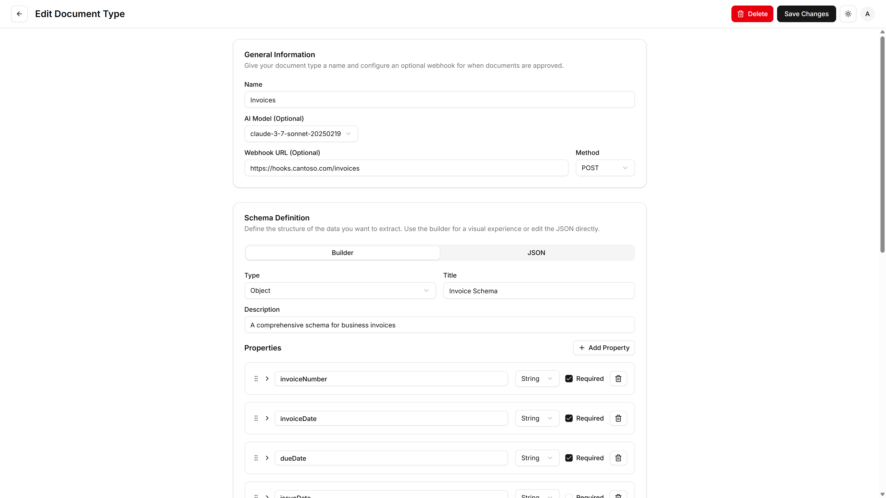
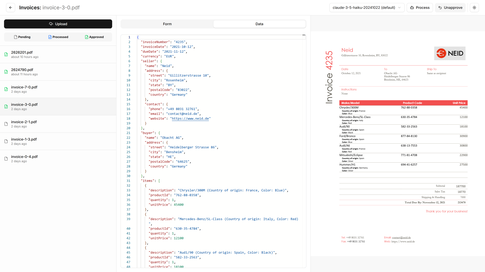
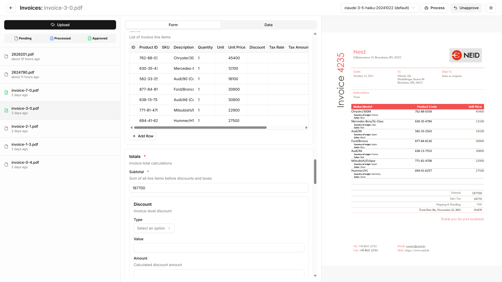

# DocProc

A human-in-the-loop document extraction platform that uses AI vision models to extract structured data from **any document type** - no training required, just define what you want extracted.


## 🤖 Universal AI Vision Extraction

- **Any Document Type**: Process invoices, contracts, forms, receipts, medical records, legal documents, and more
- **No Training Required**: Works out-of-the-box with any document format - no document-specific training needed
- **Vision-Based Understanding**: AI reads documents like humans do, understanding layout, context, and visual cues
- **Multi-Format Support**: PDFs, images, scanned documents, handwritten forms, and complex layouts

## 🔍 Why AI Vision Models?

Traditional document processing requires:

- ❌ Document-specific templates and training
- ❌ Rigid layouts and formats
- ❌ Complex OCR preprocessing pipelines
- ❌ Separate handling for different document types

**DocProc's AI Vision approach:**

- ✅ Works with any document immediately
- ✅ Understands context, not just text extraction
- ✅ Handles complex layouts, tables, and visual elements
- ✅ One system for all your document types

## 📋 Works With Any Document Type

**Financial Documents**: Invoices, receipts, bank statements, tax forms
**Legal Documents**: Contracts, agreements, court filings, compliance forms  
**Medical Records**: Patient forms, lab results, prescriptions, insurance claims
**Business Forms**: Applications, surveys, HR documents, compliance checklists
**Academic Documents**: Transcripts, certificates, research papers, applications
**Government Forms**: Permits, licenses, regulatory filings, applications
**And many more** - if you can see it, DocProc can extract from it!

_Simply define what data you want extracted (using our visual schema builder), then upload any document type - no document-specific training or templates required!_

## 📖 Application Usage - Extract From Any Document in Minutes

### 1. Define Document Types & Schemas



- Navigate to **Document Types** to create extraction schemas for your document types
- Use the **visual Schema Builder** to define what data fields should be extracted (no technical knowledge required)
- Alternative options: build schemas without the visual editor, or ask AI to create schemas for you
- Configure field types, validation rules, and structure for your specific use case
- Set up webhooks for external integrations (optional)

### 2. Human-in-the-Loop Extraction Workflow


_AI extracts structured data that humans can review in both form and JSON views_


_Intuitive form interface for reviewing and editing extracted data_

- **Upload**: Select a document type and upload documents via drag-and-drop
- **AI Extract**: Use the **Process** button to let AI extract data based on your schema
- **Human Review**: Review AI-extracted data in the form interface or JSON editor
- **Correct & Validate**: Edit any incorrect or missing data extracted by AI
- **Approve**: Finalize the extraction by approving the reviewed data
- **Export**: Use approved data for downstream processes via API or webhooks

### 3. Schema Building

- **String Fields**: Text inputs with optional patterns and validation
- **Number Fields**: Numeric inputs with min/max constraints
- **Boolean Fields**: Checkbox inputs
- **Array Fields**: Dynamic lists of items
- **Object Fields**: Nested object structures

### 4. User Management

- Access **Users** page (admin only) to manage user accounts
- Create additional users with appropriate roles
- Monitor user activity and permissions

## 🚀 Features

### 📄 Human-in-the-Loop Document Extraction

- **AI-Powered Extraction**: Extract structured data from documents using Anthropic's Claude models
- **Custom JSON Schemas**: Define extraction schemas tailored to your specific document types
- **Human Review & Approval**: Manual verification and correction of AI-extracted data
- **Multi-Format Support**: Process PDFs and images with built-in document viewer
- **Extraction Workflow**: Upload → AI Extract → Human Review/Edit → Approve → Webhook/Export

### 🔧 Schema Management

- **Visual Schema Builder**: Drag-and-drop interface for creating document schemas (no technical knowledge required)
- **Multiple Creation Methods**: Use the visual builder, write schemas manually, or ask AI to generate them
- **Field Types**: Support for strings, numbers, booleans, arrays, and objects
- **Validation**: Built-in validation with Zod schemas
- **Versioning**: Schema snapshots for document consistency

## 🚀 Deployment Quick Start

### Prerequisites

- Docker (with compose plugin)

### Technical Setup

1. **Download the env file**

   ```bash
   curl -o .env https://raw.githubusercontent.com/docproc-ai/docproc/refs/heads/main/.env.example
   ```

2. **Download the docker-compose file**

   ```bash
   curl -o docker-compose.yml https://raw.githubusercontent.com/docproc-ai/docproc/refs/heads/main/compose.yml
   ```

3. **Run the application**

   ```bash
   docker compose up -d
   ```

4. **Access the application**
   - Open [http://localhost:3000](http://localhost:3000)
   - Login with the default admin credentials (or set your own in the `.env` file):
     - Email: `admin@example.com`
     - Password: `admin123`

### Docker Deployment

1. **Using Docker Compose** (Recommended)

   ```bash
   docker compose up
   ```

2. **Access the application**
   - Open [http://localhost:3000](http://localhost:3000)
   - Login with your configured admin credentials

## 🔧 API Reference

### Document Types

- `GET /api/document-types` - List all document types
- `POST /api/document-types` - Create new document type
- `PUT /api/document-types/[id]` - Update document type
- `DELETE /api/document-types/[id]` - Delete document type
- `POST /api/document-types/[id]/upload` - Upload documents for processing

### Documents

- `GET /api/documents` - List documents
- `POST /api/documents` - Create new document
- `PUT /api/documents/[id]` - Update document
- `DELETE /api/documents/[id]` - Delete document
- `GET /api/documents/[id]/file` - Download document file

## Development Setup

1. **Install dependencies**

   ```bash
   npm install
   ```

2. **Start PostgreSQL** (if running locally)

   ```bash
   # Using Docker
   docker compose up -d postgres

   # Or use your preferred PostgreSQL setup
   ```

3. **Push database schema**

   ```bash
   npm run db:push
   ```

4. **Start development server**

   ```bash
   npm run dev
   ```

## 🙏 Acknowledgments

- [Next.js](https://nextjs.org/) - React framework
- [Anthropic](https://www.anthropic.com/) - AI processing capabilities
- [Shadcn/ui](https://ui.shadcn.com/) - UI component library
- [Drizzle ORM](https://orm.drizzle.team/) - Database ORM
- [Better-auth](https://www.better-auth.com/) - Authentication solution
