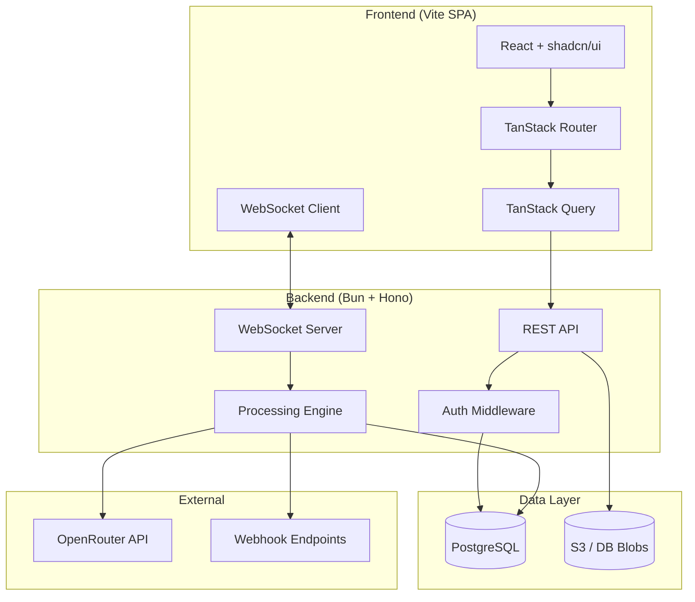
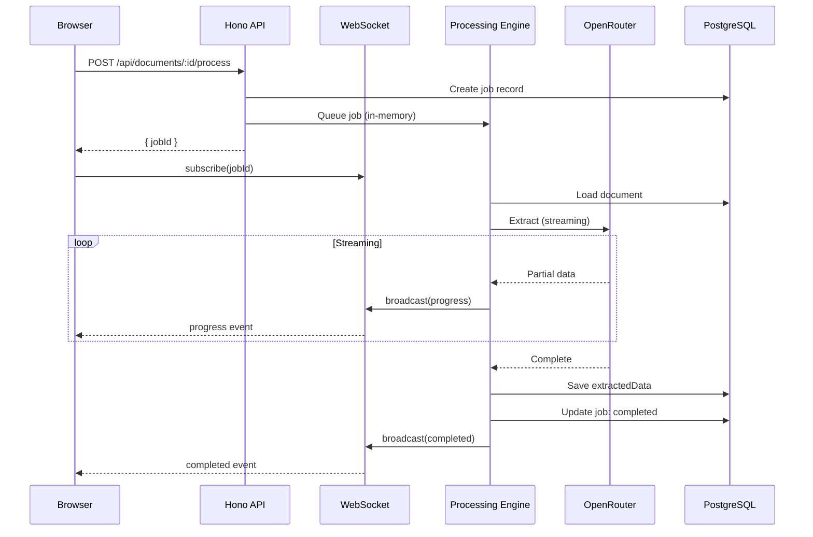
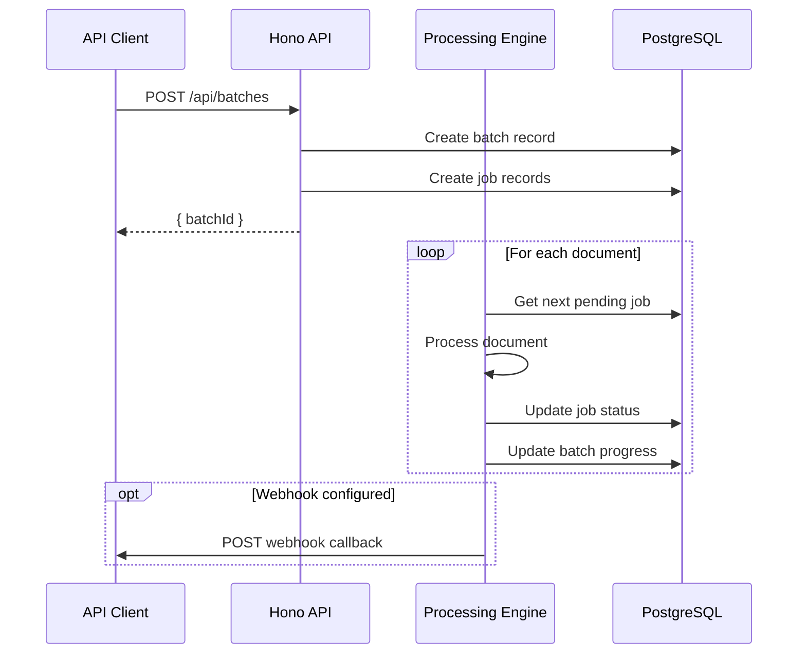

# Overview (Target)

## What is DocProc?

DocProc is a **human-in-the-loop document extraction platform** that uses AI vision models to extract structured data from documents. It combines automated AI processing with manual verification workflows to ensure data accuracy.

## Target Architecture

### Stack

| Component | Technology | Rationale |
|-----------|------------|-----------|
| Runtime | **Bun** | Fast startup, native TS, built-in bundler |
| Backend | **Hono** | Lightweight, type-safe, excellent middleware |
| Frontend | **Vite + React** | Sub-second HMR, fast production builds |
| Routing | **TanStack Router** | Type-safe routes, built-in data loading |
| Server State | **TanStack Query** | Caching, background refetch, mutations |
| Database | **PostgreSQL + Drizzle** | Already proven, excellent DX |
| AI | **OpenRouter** | Unified API for all models |
| Real-time | **WebSocket** | True push, bidirectional |
| Storage | **S3 or DB** | Scalable, flexible |

### System Architecture



## Directory Structure

```
docproc/
├── src/
│   ├── client/                    # Frontend SPA
│   │   ├── routes/                # TanStack Router file-based routes
│   │   │   ├── __root.tsx
│   │   │   ├── index.tsx
│   │   │   ├── document-types/
│   │   │   │   ├── index.tsx
│   │   │   │   └── $id.tsx
│   │   │   └── settings.tsx
│   │   ├── components/            # React components
│   │   │   ├── ui/                # shadcn/ui (unchanged)
│   │   │   ├── document-processor.tsx
│   │   │   ├── document-queue.tsx
│   │   │   ├── document-viewer.tsx
│   │   │   ├── form-renderer/
│   │   │   └── schema-builder/
│   │   ├── lib/
│   │   │   ├── api.ts             # Typed API client
│   │   │   ├── ws.ts              # WebSocket client
│   │   │   └── auth.ts            # Auth client
│   │   ├── queries/               # TanStack Query definitions
│   │   │   ├── documents.ts
│   │   │   ├── document-types.ts
│   │   │   └── batches.ts
│   │   ├── main.tsx
│   │   └── router.tsx
│   │
│   ├── server/                    # Backend API
│   │   ├── routes/
│   │   │   ├── auth.ts
│   │   │   ├── documents.ts
│   │   │   ├── document-types.ts
│   │   │   ├── batches.ts
│   │   │   └── files.ts
│   │   ├── middleware/
│   │   │   ├── auth.ts
│   │   │   ├── cors.ts
│   │   │   └── error.ts
│   │   ├── processing/
│   │   │   ├── engine.ts          # Job execution
│   │   │   ├── queue.ts           # In-memory + DB queue
│   │   │   └── openrouter.ts      # OpenRouter client
│   │   ├── ws/
│   │   │   ├── server.ts
│   │   │   └── handlers.ts
│   │   ├── storage/
│   │   │   ├── index.ts           # Storage interface
│   │   │   ├── s3.ts              # S3 implementation
│   │   │   ├── database.ts        # DB blob implementation
│   │   │   └── local.ts           # Local FS (dev only)
│   │   └── index.ts               # Server entry
│   │
│   ├── db/                        # Database (mostly unchanged)
│   │   ├── schema/
│   │   │   ├── app.ts
│   │   │   ├── auth.ts
│   │   │   └── jobs.ts            # NEW: Job persistence
│   │   └── index.ts
│   │
│   └── shared/                    # Shared types
│       ├── types/
│       │   ├── documents.ts
│       │   ├── batches.ts
│       │   └── api.ts
│       └── validation/
│           └── schemas.ts
│
├── public/                        # Static assets
├── drizzle/                       # Migrations
├── vite.config.ts
├── bunfig.toml
└── package.json
```

## Data Flow

### Document Processing



### Batch Processing



## Key Design Decisions

### 1. OpenRouter Only

Single AI provider simplifies:
- Configuration (one API key)
- Error handling (one error format)
- Model switching (just change model string)
- Cost tracking (unified billing)

### 2. No Redis

PostgreSQL handles everything:
- Job persistence (survives restarts)
- Job status queries
- Batch tracking
- No extra infrastructure

### 3. WebSocket for Real-time

Benefits over SSE:
- Bidirectional (cancel jobs, change subscriptions)
- Single connection per client
- Native Bun/Hono support
- Lower latency

### 4. TanStack Router + Query

Benefits:
- Type-safe routes with inferred params
- Data loading at route level
- Automatic cache management
- Optimistic updates

## Migration Considerations

### What Stays the Same

- Database schema (mostly)
- UI components (React + shadcn/ui)
- Form renderer logic
- Schema builder
- Webhook system

### What Changes

| Component | Migration Effort |
|-----------|------------------|
| API routes | Medium - rewrite as Hono handlers |
| Server actions | Medium - convert to TanStack mutations |
| Auth | Low - better-auth has Hono adapter |
| File storage | Medium - implement storage interface |
| Job queue | Medium - replace BullMQ with simple queue |
| Real-time | Medium - SSE → WebSocket |
| Routing | Low - similar patterns to Next.js |
