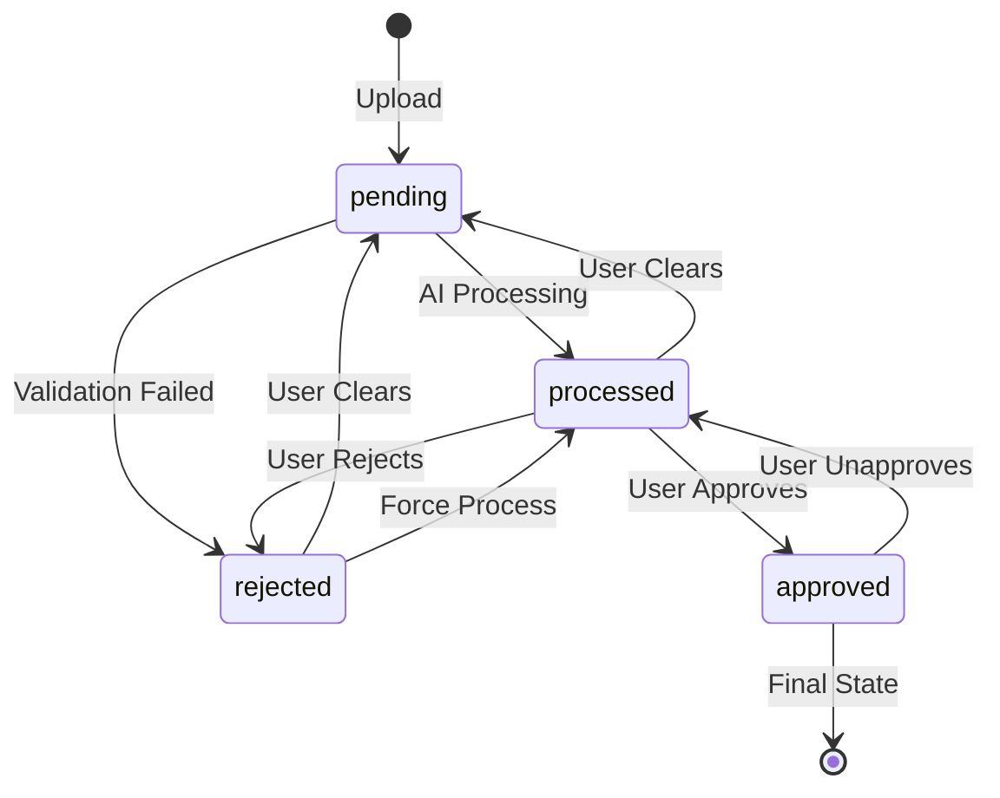
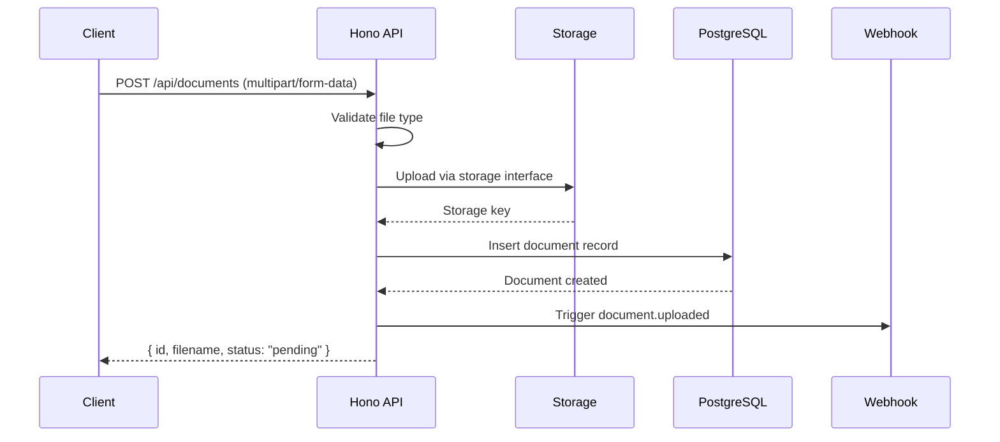

# Documents (Target)

## Overview

Documents remain largely unchanged from the current implementation. The main difference is storage abstraction and integration with the new processing engine.

## Changes from Current

| Aspect | Current | Target |
|--------|---------|--------|
| Storage | Local filesystem | Storage interface (S3/DB/Local) |
| Status updates | Server actions | Hono API routes |
| Real-time | SSE polling | WebSocket push |
| File serving | Next.js API | Hono with presigned URLs |

## Data Model

```typescript
interface Document {
  id: string                        // UUID
  documentTypeId: string            // FK to DocumentType
  status: DocumentStatus            // Workflow status
  filename: string                  // Original filename
  storageKey: string                // Storage provider key (changed from storagePath)
  extractedData: object             // AI-extracted structured data
  schemaSnapshot: JsonSchema        // Schema at time of processing
  rejectionReason: string           // Reason for rejection
  createdAt: Date
  updatedAt: Date
  createdBy: string                 // User ID
  updatedBy: string                 // User ID
}

type DocumentStatus = 'pending' | 'processed' | 'approved' | 'rejected'
```

## Status Workflow

Unchanged from current:



## Upload Flow



### Storage Integration

```typescript
// src/server/routes/documents.ts
import { storage } from '../storage'

app.post('/api/documents', requireAuth, async (c) => {
  const formData = await c.req.formData()
  const file = formData.get('file') as File
  const documentTypeId = formData.get('documentTypeId') as string

  // Validate file type
  if (!isValidFileType(file.type)) {
    return c.json({ error: 'Invalid file type' }, 415)
  }

  // Upload to storage
  const buffer = Buffer.from(await file.arrayBuffer())
  const storageKey = await storage.upload(buffer, file.name, file.type)

  // Create record
  const document = await db.insert(documents).values({
    id: crypto.randomUUID(),
    documentTypeId,
    filename: file.name,
    storageKey,
    status: 'pending',
    createdBy: c.get('user').id,
  }).returning()

  // Trigger webhook
  await triggerWebhook(documentTypeId, document[0], 'document.uploaded')

  return c.json(document[0])
})
```

## API Endpoints

### Create Document

```typescript
// POST /api/documents
app.post('/api/documents', requireAuth, requirePermission('document:create'), async (c) => {
  const formData = await c.req.formData()
  // ... upload logic
})
```

### List Documents

```typescript
// GET /api/documents?documentTypeId=xxx&page=1&pageSize=50&status=pending&search=invoice
app.get('/api/documents', requireApiKeyOrAuth, async (c) => {
  const { documentTypeId, page = 1, pageSize = 50, status, search } = c.req.query()

  const offset = (Number(page) - 1) * Number(pageSize)

  let query = db.select().from(documents)
    .where(eq(documents.documentTypeId, documentTypeId))
    .limit(Number(pageSize))
    .offset(offset)
    .orderBy(desc(documents.createdAt))

  if (status && status !== 'all') {
    query = query.where(eq(documents.status, status))
  }

  if (search) {
    query = query.where(ilike(documents.filename, `%${search}%`))
  }

  const [docs, total] = await Promise.all([
    query,
    db.select({ count: sql`count(*)` }).from(documents)
      .where(eq(documents.documentTypeId, documentTypeId)),
  ])

  return c.json({
    documents: docs,
    pagination: {
      page: Number(page),
      pageSize: Number(pageSize),
      total: total[0].count,
      totalPages: Math.ceil(total[0].count / Number(pageSize)),
    },
  })
})
```

### Get Document

```typescript
// GET /api/documents/:id
app.get('/api/documents/:id', requireApiKeyOrAuth, async (c) => {
  const doc = await db.query.documents.findFirst({
    where: eq(documents.id, c.req.param('id')),
  })

  if (!doc) {
    return c.json({ error: 'Not found' }, 404)
  }

  return c.json(doc)
})
```

### Update Document

```typescript
// PUT /api/documents/:id
app.put('/api/documents/:id', requireAuth, requirePermission('document:update'), async (c) => {
  const id = c.req.param('id')
  const body = await c.req.json()

  const oldDoc = await db.query.documents.findFirst({
    where: eq(documents.id, id),
  })

  if (!oldDoc) {
    return c.json({ error: 'Not found' }, 404)
  }

  const doc = await db.update(documents)
    .set({
      extractedData: body.extractedData,
      status: body.status,
      schemaSnapshot: body.schemaSnapshot,
      rejectionReason: body.rejectionReason,
      updatedBy: c.get('user').id,
      updatedAt: new Date(),
    })
    .where(eq(documents.id, id))
    .returning()

  // Trigger webhooks on status change
  if (oldDoc.status !== body.status) {
    if (body.status === 'approved') {
      await triggerWebhook(oldDoc.documentTypeId, doc[0], 'document.approved')
    } else if (oldDoc.status === 'approved') {
      await triggerWebhook(oldDoc.documentTypeId, doc[0], 'document.unapproved')
    }
  }

  return c.json(doc[0])
})
```

### Delete Document

```typescript
// DELETE /api/documents/:id
app.delete('/api/documents/:id', requireAuth, requirePermission('document:delete'), async (c) => {
  const id = c.req.param('id')

  const doc = await db.query.documents.findFirst({
    where: eq(documents.id, id),
  })

  if (!doc) {
    return c.json({ error: 'Not found' }, 404)
  }

  // Delete from storage
  await storage.delete(doc.storageKey)

  // Delete from database
  await db.delete(documents).where(eq(documents.id, id))

  return c.json({ success: true })
})
```

### Download File

```typescript
// GET /api/documents/:id/file
app.get('/api/documents/:id/file', requireApiKeyOrAuth, async (c) => {
  const doc = await db.query.documents.findFirst({
    where: eq(documents.id, c.req.param('id')),
  })

  if (!doc) {
    return c.json({ error: 'Not found' }, 404)
  }

  // For S3, optionally redirect to presigned URL
  if (storage.getUrl) {
    const url = await storage.getUrl(doc.storageKey)
    return c.redirect(url)
  }

  // Otherwise stream from storage
  const { buffer, mimeType } = await storage.download(doc.storageKey)

  return new Response(buffer, {
    headers: {
      'Content-Type': mimeType,
      'Content-Disposition': `inline; filename="${doc.filename}"`,
    },
  })
})
```

## Bulk Operations

### Bulk Status Update

```typescript
// POST /api/documents/bulk-status
app.post('/api/documents/bulk-status', requireAuth, requirePermission('document:update'), async (c) => {
  const { documentIds, status } = await c.req.json()

  const results = await db.update(documents)
    .set({
      status,
      updatedBy: c.get('user').id,
      updatedAt: new Date(),
    })
    .where(inArray(documents.id, documentIds))
    .returning()

  // Trigger webhooks for status changes
  for (const doc of results) {
    if (status === 'approved') {
      await triggerWebhook(doc.documentTypeId, doc, 'document.approved')
    }
  }

  return c.json({ updated: results.length })
})
```

### Bulk Delete

```typescript
// POST /api/documents/bulk-delete
app.post('/api/documents/bulk-delete', requireAuth, requirePermission('document:delete'), async (c) => {
  const { documentIds } = await c.req.json()

  const docs = await db.query.documents.findMany({
    where: inArray(documents.id, documentIds),
  })

  // Delete from storage
  await Promise.all(docs.map(doc => storage.delete(doc.storageKey)))

  // Delete from database
  await db.delete(documents).where(inArray(documents.id, documentIds))

  return c.json({ deleted: docs.length })
})
```

## Document Rotation

```typescript
// POST /api/documents/:id/rotate
app.post('/api/documents/:id/rotate', requireAuth, requirePermission('document:update'), async (c) => {
  const { degrees } = await c.req.json()
  const id = c.req.param('id')

  const doc = await db.query.documents.findFirst({
    where: eq(documents.id, id),
  })

  if (!doc) {
    return c.json({ error: 'Not found' }, 404)
  }

  // Download current file
  const { buffer, mimeType } = await storage.download(doc.storageKey)

  let rotatedBuffer: Buffer

  if (mimeType === 'application/pdf') {
    // Rotate PDF pages
    const { PDFDocument } = await import('pdf-lib')
    const pdfDoc = await PDFDocument.load(buffer)
    const pages = pdfDoc.getPages()

    for (const page of pages) {
      page.setRotation(degrees(page.getRotation().angle + degrees))
    }

    rotatedBuffer = Buffer.from(await pdfDoc.save())
  } else {
    // Rotate image
    const sharp = await import('sharp')
    rotatedBuffer = await sharp(buffer).rotate(degrees).toBuffer()
  }

  // Upload rotated file (same key to overwrite)
  await storage.delete(doc.storageKey)
  const newKey = await storage.upload(rotatedBuffer, doc.filename, mimeType)

  // Update storage key if changed
  if (newKey !== doc.storageKey) {
    await db.update(documents)
      .set({ storageKey: newKey })
      .where(eq(documents.id, id))
  }

  return c.json({ success: true })
})
```

## Database Schema

```sql
CREATE TABLE documents (
  id TEXT PRIMARY KEY,
  document_type_id TEXT REFERENCES document_types(id) ON DELETE CASCADE,
  status TEXT NOT NULL DEFAULT 'pending',
  filename TEXT NOT NULL,
  storage_key TEXT NOT NULL,  -- Changed from storage_path
  extracted_data JSONB,
  schema_snapshot JSONB,
  rejection_reason TEXT,
  created_at TIMESTAMP DEFAULT NOW(),
  updated_at TIMESTAMP DEFAULT NOW(),
  created_by TEXT REFERENCES "user"(id),
  updated_by TEXT REFERENCES "user"(id)
);

CREATE INDEX idx_documents_document_type_id ON documents(document_type_id);
CREATE INDEX idx_documents_status ON documents(status);
CREATE INDEX idx_documents_created_at ON documents(created_at);
```

## Migration Notes

### From Current to Target

```sql
-- Rename storage_path to storage_key
ALTER TABLE documents RENAME COLUMN storage_path TO storage_key;

-- For local storage migration, storage_key remains the same (filename)
-- For S3 migration, run migration script to upload files and update keys
```

## Client Integration

### TanStack Query Hooks

```typescript
// src/client/queries/documents.ts
import { useQuery, useMutation, useQueryClient } from '@tanstack/react-query'
import { api } from '../lib/api'

export function useDocuments(documentTypeId: string, filters: DocumentFilters) {
  return useQuery({
    queryKey: ['documents', documentTypeId, filters],
    queryFn: () => api.documents.list({ documentTypeId, ...filters }),
  })
}

export function useDocument(documentId: string | null) {
  return useQuery({
    queryKey: ['document', documentId],
    queryFn: () => api.documents.get(documentId!),
    enabled: !!documentId,
  })
}

export function useUpdateDocument() {
  const queryClient = useQueryClient()

  return useMutation({
    mutationFn: (data: UpdateDocumentInput) => api.documents.update(data),
    onSuccess: (doc) => {
      queryClient.invalidateQueries({ queryKey: ['document', doc.id] })
      queryClient.invalidateQueries({ queryKey: ['documents'] })
    },
  })
}

export function useDeleteDocument() {
  const queryClient = useQueryClient()

  return useMutation({
    mutationFn: (documentId: string) => api.documents.delete(documentId),
    onSuccess: () => {
      queryClient.invalidateQueries({ queryKey: ['documents'] })
    },
  })
}
```

### Real-time Updates

See [Processing](./05-processing.md) for WebSocket integration that updates document status in real-time.
