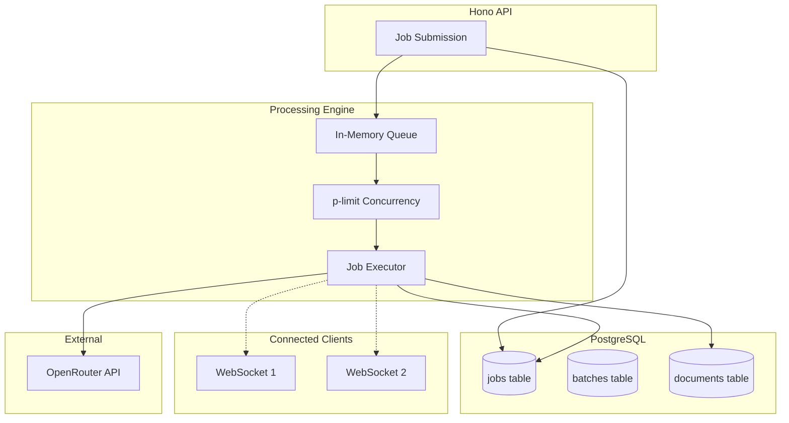

# Document Processing (Target)

## Overview

The target architecture replaces BullMQ + Redis with a simple in-process queue backed by PostgreSQL for persistence. Real-time updates use WebSocket instead of SSE.

## Changes from Current

| Aspect | Current | Target |
|--------|---------|--------|
| Job queue | BullMQ + Redis | In-process + PostgreSQL |
| Real-time | SSE polling | WebSocket |
| AI provider | Anthropic + OpenRouter | OpenRouter only |
| Concurrency | BullMQ workers | p-limit |

## Architecture



## Database Schema

### Jobs Table

```sql
CREATE TABLE jobs (
  id TEXT PRIMARY KEY,
  document_id TEXT REFERENCES documents(id) ON DELETE CASCADE,
  batch_id TEXT REFERENCES batches(id) ON DELETE CASCADE,
  status TEXT NOT NULL DEFAULT 'pending',  -- pending, processing, completed, failed
  progress INTEGER DEFAULT 0,
  partial_data JSONB,
  error TEXT,
  created_at TIMESTAMP DEFAULT NOW(),
  started_at TIMESTAMP,
  completed_at TIMESTAMP,
  created_by TEXT REFERENCES "user"(id)
);

CREATE INDEX idx_jobs_status ON jobs(status);
CREATE INDEX idx_jobs_batch_id ON jobs(batch_id);
CREATE INDEX idx_jobs_document_id ON jobs(document_id);
```

### Batches Table

```sql
CREATE TABLE batches (
  id TEXT PRIMARY KEY,
  document_type_id TEXT REFERENCES document_types(id),
  total INTEGER NOT NULL,
  completed INTEGER DEFAULT 0,
  failed INTEGER DEFAULT 0,
  status TEXT NOT NULL DEFAULT 'pending',  -- pending, processing, completed, failed, cancelled
  webhook_url TEXT,
  created_at TIMESTAMP DEFAULT NOW(),
  completed_at TIMESTAMP,
  created_by TEXT REFERENCES "user"(id)
);
```

## Processing Engine

### Core Implementation

```typescript
// src/server/processing/engine.ts
import pLimit from 'p-limit'
import { db } from '../../db'
import { jobs, documents } from '../../db/schema'
import { extractWithOpenRouter } from './openrouter'
import { broadcast } from '../ws/server'

// Concurrency limit (5 parallel AI calls)
const limit = pLimit(5)

// In-memory queue for active jobs
const activeJobs = new Map<string, AbortController>()

export async function queueJob(jobId: string): Promise<void> {
  // Add to execution queue with concurrency limit
  limit(() => executeJob(jobId))
}

async function executeJob(jobId: string): Promise<void> {
  const abortController = new AbortController()
  activeJobs.set(jobId, abortController)

  try {
    // Update status to processing
    await db.update(jobs)
      .set({ status: 'processing', startedAt: new Date() })
      .where(eq(jobs.id, jobId))

    // Load job details
    const job = await db.query.jobs.findFirst({
      where: eq(jobs.id, jobId),
      with: { document: true },
    })

    if (!job) throw new Error('Job not found')

    // Load document type for schema
    const docType = await db.query.documentTypes.findFirst({
      where: eq(documentTypes.id, job.document.documentTypeId),
    })

    // Broadcast start
    broadcast(job.documentId, { type: 'started', jobId })

    // Process with OpenRouter (streaming)
    let lastProgress = 0
    const result = await extractWithOpenRouter({
      documentId: job.documentId,
      schema: docType.schema,
      signal: abortController.signal,
      onProgress: async (progress, partialData) => {
        // Update database periodically (every 10%)
        if (progress - lastProgress >= 10) {
          await db.update(jobs)
            .set({ progress, partialData })
            .where(eq(jobs.id, jobId))
          lastProgress = progress
        }

        // Broadcast to WebSocket clients
        broadcast(job.documentId, {
          type: 'progress',
          jobId,
          progress,
          partialData,
        })
      },
    })

    // Save result
    await db.update(documents)
      .set({
        extractedData: result,
        status: 'processed',
        schemaSnapshot: docType.schema,
      })
      .where(eq(documents.id, job.documentId))

    await db.update(jobs)
      .set({
        status: 'completed',
        progress: 100,
        partialData: result,
        completedAt: new Date(),
      })
      .where(eq(jobs.id, jobId))

    // Update batch if applicable
    if (job.batchId) {
      await updateBatchProgress(job.batchId)
    }

    // Broadcast completion
    broadcast(job.documentId, { type: 'completed', jobId, data: result })

  } catch (error) {
    const errorMessage = error instanceof Error ? error.message : 'Unknown error'

    await db.update(jobs)
      .set({ status: 'failed', error: errorMessage, completedAt: new Date() })
      .where(eq(jobs.id, jobId))

    // Update batch if applicable
    const job = await db.query.jobs.findFirst({ where: eq(jobs.id, jobId) })
    if (job?.batchId) {
      await updateBatchProgress(job.batchId)
    }

    broadcast(job?.documentId || '', { type: 'failed', jobId, error: errorMessage })

  } finally {
    activeJobs.delete(jobId)
  }
}

export function cancelJob(jobId: string): boolean {
  const controller = activeJobs.get(jobId)
  if (controller) {
    controller.abort()
    return true
  }
  return false
}
```

### Batch Progress

```typescript
// src/server/processing/engine.ts
async function updateBatchProgress(batchId: string): Promise<void> {
  const batch = await db.query.batches.findFirst({
    where: eq(batches.id, batchId),
  })

  if (!batch) return

  // Count job statuses
  const stats = await db
    .select({
      status: jobs.status,
      count: sql<number>`count(*)`,
    })
    .from(jobs)
    .where(eq(jobs.batchId, batchId))
    .groupBy(jobs.status)

  const completed = stats.find(s => s.status === 'completed')?.count || 0
  const failed = stats.find(s => s.status === 'failed')?.count || 0
  const total = batch.total

  // Determine batch status
  let status = 'processing'
  if (completed + failed === total) {
    status = failed === total ? 'failed' : 'completed'
  }

  await db.update(batches)
    .set({
      completed,
      failed,
      status,
      ...(status !== 'processing' ? { completedAt: new Date() } : {}),
    })
    .where(eq(batches.id, batchId))

  // Fire webhook if completed
  if (status !== 'processing' && batch.webhookUrl) {
    await fireWebhook(batch.webhookUrl, { batchId, status, completed, failed, total })
  }

  // Broadcast batch progress
  broadcastBatch(batchId, { type: 'batch-progress', completed, failed, total, status })
}
```

### Startup Recovery

```typescript
// src/server/processing/recovery.ts
export async function recoverPendingJobs(): Promise<void> {
  // Find jobs that were processing when server stopped
  const pendingJobs = await db.query.jobs.findMany({
    where: inArray(jobs.status, ['pending', 'processing']),
  })

  console.log(`Recovering ${pendingJobs.length} pending jobs...`)

  for (const job of pendingJobs) {
    // Reset to pending and re-queue
    await db.update(jobs)
      .set({ status: 'pending', startedAt: null })
      .where(eq(jobs.id, job.id))

    queueJob(job.id)
  }
}
```

## OpenRouter Integration

### Client

```typescript
// src/server/processing/openrouter.ts
import { createOpenRouter } from '@openrouter/ai-sdk-provider'
import { streamObject } from 'ai'
import { getDocumentBuffer } from '../storage'

const openrouter = createOpenRouter({
  apiKey: process.env.OPENROUTER_API_KEY,
})

interface ExtractOptions {
  documentId: string
  schema: JsonSchema
  model?: string
  signal?: AbortSignal
  onProgress?: (progress: number, partialData: any) => void
}

export async function extractWithOpenRouter(options: ExtractOptions): Promise<any> {
  const {
    documentId,
    schema,
    model = process.env.OPENROUTER_DEFAULT_MODEL || 'anthropic/claude-3.5-sonnet',
    signal,
    onProgress,
  } = options

  // Load document file
  const { buffer, mimeType } = await getDocumentBuffer(documentId)

  const systemPrompt = `You are a document extraction assistant.
Today's date is ${new Date().toLocaleDateString()}.
Extract structured data from the document according to the provided schema.
Be precise and extract only what is visible in the document.`

  const { partialObjectStream, object } = await streamObject({
    model: openrouter(model),
    schema: jsonSchema(schema),
    messages: [
      { role: 'system', content: systemPrompt },
      {
        role: 'user',
        content: [
          { type: 'file', data: buffer, mimeType },
          { type: 'text', text: `Extract data according to this schema:\n${JSON.stringify(schema, null, 2)}` },
        ],
      },
    ],
    abortSignal: signal,
  })

  // Stream progress
  let progress = 0
  for await (const partial of partialObjectStream) {
    progress = Math.min(progress + 5, 95) // Estimate progress
    onProgress?.(progress, partial)
  }

  const result = await object
  onProgress?.(100, result)

  return result
}
```

### Model Selection

No more provider switching - just specify model string:

```typescript
// Available via OpenRouter:
'anthropic/claude-3.5-sonnet'
'anthropic/claude-3-opus'
'openai/gpt-4o'
'google/gemini-pro-vision'
// etc.
```

## WebSocket

### Server Setup

```typescript
// src/server/ws/server.ts
import type { ServerWebSocket } from 'bun'

interface WSData {
  subscriptions: Set<string>
}

const clients = new Set<ServerWebSocket<WSData>>()
const subscriptions = new Map<string, Set<ServerWebSocket<WSData>>>()

export const wsHandler = {
  open(ws: ServerWebSocket<WSData>) {
    ws.data = { subscriptions: new Set() }
    clients.add(ws)
  },

  message(ws: ServerWebSocket<WSData>, message: string) {
    const data = JSON.parse(message)

    switch (data.type) {
      case 'subscribe':
        subscribe(ws, data.channel)
        break
      case 'unsubscribe':
        unsubscribe(ws, data.channel)
        break
      case 'cancel':
        cancelJob(data.jobId)
        break
    }
  },

  close(ws: ServerWebSocket<WSData>) {
    clients.delete(ws)
    // Clean up subscriptions
    for (const channel of ws.data.subscriptions) {
      subscriptions.get(channel)?.delete(ws)
    }
  },
}

function subscribe(ws: ServerWebSocket<WSData>, channel: string) {
  if (!subscriptions.has(channel)) {
    subscriptions.set(channel, new Set())
  }
  subscriptions.get(channel)!.add(ws)
  ws.data.subscriptions.add(channel)
}

function unsubscribe(ws: ServerWebSocket<WSData>, channel: string) {
  subscriptions.get(channel)?.delete(ws)
  ws.data.subscriptions.delete(channel)
}

export function broadcast(channel: string, data: any) {
  const message = JSON.stringify(data)
  subscriptions.get(channel)?.forEach(ws => {
    ws.send(message)
  })
}

export function broadcastBatch(batchId: string, data: any) {
  broadcast(`batch:${batchId}`, data)
}
```

### Client Hook

```typescript
// src/client/lib/ws.ts
import { useEffect, useRef, useCallback } from 'react'
import { useQueryClient } from '@tanstack/react-query'

const WS_URL = import.meta.env.VITE_WS_URL || 'ws://localhost:3001/ws'

export function useDocumentUpdates(documentId: string | null) {
  const queryClient = useQueryClient()
  const wsRef = useRef<WebSocket | null>(null)

  useEffect(() => {
    if (!documentId) return

    const ws = new WebSocket(WS_URL)
    wsRef.current = ws

    ws.onopen = () => {
      ws.send(JSON.stringify({ type: 'subscribe', channel: documentId }))
    }

    ws.onmessage = (event) => {
      const data = JSON.parse(event.data)

      switch (data.type) {
        case 'progress':
          // Update cache with partial data
          queryClient.setQueryData(['document', documentId], (old: any) => ({
            ...old,
            _processing: true,
            _progress: data.progress,
            extractedData: data.partialData,
          }))
          break

        case 'completed':
          // Invalidate to refetch final data
          queryClient.invalidateQueries({ queryKey: ['document', documentId] })
          queryClient.invalidateQueries({ queryKey: ['documents'] })
          break

        case 'failed':
          queryClient.invalidateQueries({ queryKey: ['document', documentId] })
          break
      }
    }

    return () => {
      ws.send(JSON.stringify({ type: 'unsubscribe', channel: documentId }))
      ws.close()
    }
  }, [documentId, queryClient])

  const cancel = useCallback((jobId: string) => {
    wsRef.current?.send(JSON.stringify({ type: 'cancel', jobId }))
  }, [])

  return { cancel }
}
```

## API Endpoints

### Process Single Document

```typescript
// POST /api/documents/:id/process
app.post('/api/documents/:id/process', requireAuth, async (c) => {
  const documentId = c.req.param('id')
  const user = c.get('user')

  // Create job
  const jobId = `job-${documentId}-${Date.now()}`

  await db.insert(jobs).values({
    id: jobId,
    documentId,
    status: 'pending',
    createdBy: user.id,
  })

  // Queue for processing
  queueJob(jobId)

  return c.json({ jobId, documentId })
})
```

### Process Batch

```typescript
// POST /api/batches
app.post('/api/batches', requireApiKeyOrAuth, async (c) => {
  const { documentIds, webhookUrl } = await c.req.json()
  const user = c.get('user')

  const batchId = crypto.randomUUID()

  // Create batch
  await db.insert(batches).values({
    id: batchId,
    documentTypeId: documentIds[0], // TODO: validate same type
    total: documentIds.length,
    webhookUrl,
    createdBy: user?.id,
  })

  // Create jobs
  const jobRecords = documentIds.map((docId, i) => ({
    id: `job-${docId}-${Date.now()}-${i}`,
    documentId: docId,
    batchId,
    status: 'pending',
    createdBy: user?.id,
  }))

  await db.insert(jobs).values(jobRecords)

  // Queue all jobs
  for (const job of jobRecords) {
    queueJob(job.id)
  }

  return c.json({ batchId, jobCount: documentIds.length })
})
```

### Get Batch Status

```typescript
// GET /api/batches/:id
app.get('/api/batches/:id', requireApiKeyOrAuth, async (c) => {
  const batchId = c.req.param('id')

  const batch = await db.query.batches.findFirst({
    where: eq(batches.id, batchId),
  })

  if (!batch) {
    return c.json({ error: 'Batch not found' }, 404)
  }

  return c.json(batch)
})
```

## Comparison: Current vs Target

| Feature | Current (BullMQ) | Target (Simple) |
|---------|------------------|-----------------|
| Job persistence | Redis | PostgreSQL |
| Concurrency | BullMQ workers | p-limit |
| Retry logic | BullMQ automatic | Manual (if needed) |
| Progress tracking | Redis pub/sub | PostgreSQL + WebSocket |
| Job cancellation | BullMQ API | AbortController |
| Batch management | BullMQ groups | Database queries |
| Real-time updates | SSE polling | WebSocket push |
| Dependencies | Redis + BullMQ | None (PostgreSQL) |
