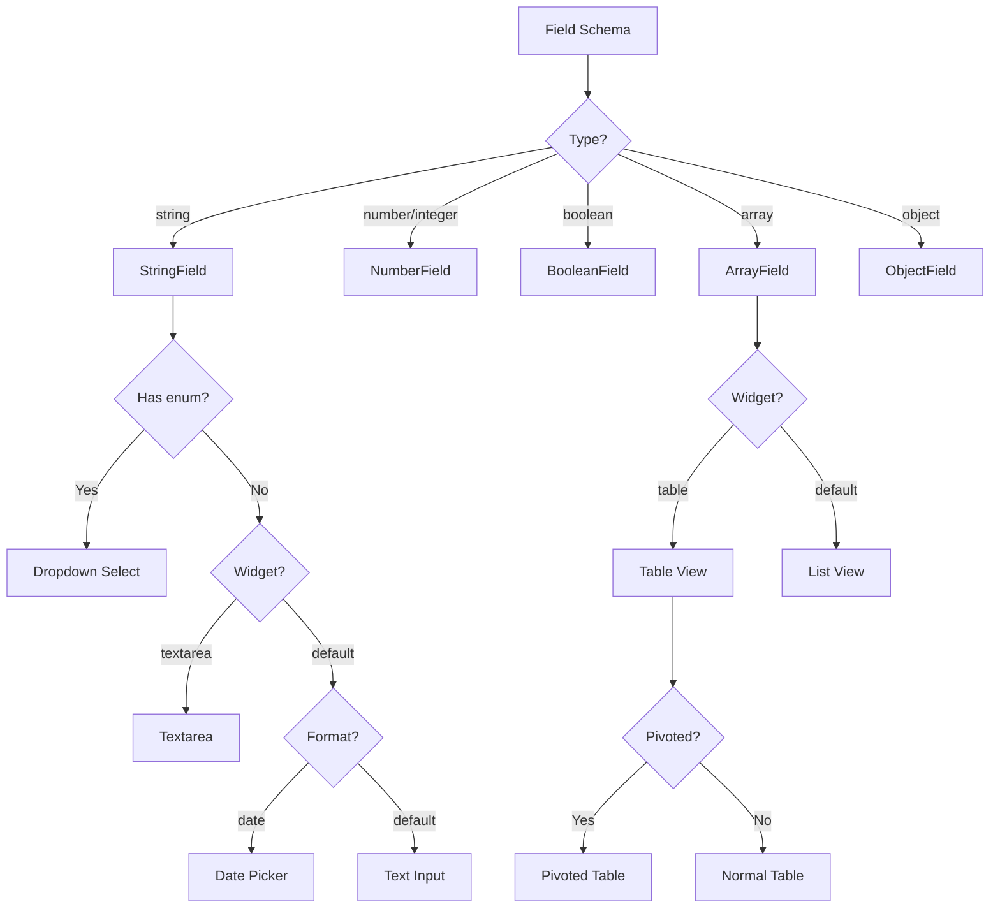
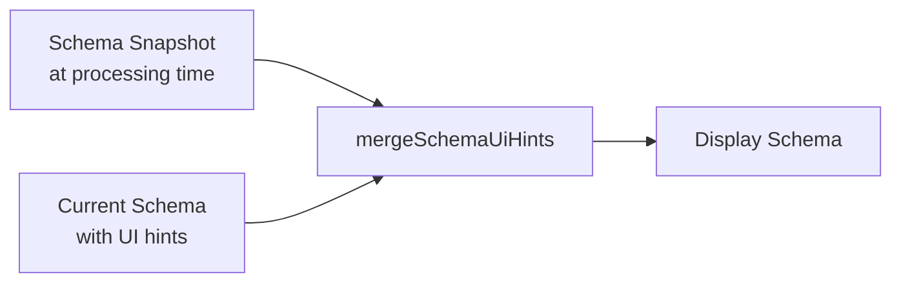

# Forms & Schema (Target)

## Overview

The Form Renderer and Schema Builder remain **unchanged** from the current implementation. They are React components that work independently of the backend framework.

## Changes from Current

| Aspect | Current | Target |
|--------|---------|--------|
| Form Renderer | Same | Same |
| Schema Builder | Same | Same |
| Data source | Server actions | TanStack Query |
| Streaming mode | SSE events | WebSocket events |

## Schema Builder

### Purpose

Visual editor for creating JSON extraction schemas without writing JSON manually.

### Components

```
src/client/components/schema-builder/
├── index.tsx              # Main SchemaBuilder component
├── string-field-builder.tsx
├── number-field-builder.tsx
├── array-field-builder.tsx
├── object-field-builder.tsx
├── enum-builder.tsx
└── types.ts
```

### Usage

```tsx
import { SchemaBuilder } from '@/components/schema-builder'

function DocumentTypeEditor() {
  const [schema, setSchema] = useState(initialSchema)

  return (
    <SchemaBuilder
      schema={schema}
      onChange={setSchema}
    />
  )
}
```

## Form Renderer

### Purpose

Render editable forms from JSON schemas for data review and editing.

### Components

```
src/client/components/form-renderer/
├── index.tsx              # Main FormRenderer + FormField
├── string-field.tsx       # Text, textarea, date, dropdown
├── number-field.tsx       # Number inputs
├── boolean-field.tsx      # Checkbox
├── array-field.tsx        # Lists and tables
├── object-field.tsx       # Nested objects
└── types.ts
```

### Field Type Rendering



### Usage with TanStack Query

```tsx
// src/client/routes/document-types/$id.tsx
import { FormRenderer } from '@/components/form-renderer'
import { useDocument, useUpdateDocument } from '@/queries/documents'

function DocumentEditor({ documentId, schema }) {
  const { data: document } = useDocument(documentId)
  const updateDocument = useUpdateDocument()

  const [formData, setFormData] = useState(document?.extractedData)

  const handleSave = () => {
    updateDocument.mutate({
      id: documentId,
      extractedData: formData,
    })
  }

  return (
    <FormRenderer
      schema={schema}
      data={formData}
      onChange={setFormData}
      isStreaming={false}
    />
  )
}
```

### Streaming Mode with WebSocket

```tsx
// src/client/components/document-processor.tsx
import { FormRenderer } from '@/components/form-renderer'
import { useDocumentUpdates } from '@/lib/ws'

function DocumentProcessor({ documentId, schema }) {
  const [formData, setFormData] = useState(null)
  const [isStreaming, setIsStreaming] = useState(false)

  // WebSocket updates during processing
  useEffect(() => {
    const ws = new WebSocket(WS_URL)

    ws.onopen = () => {
      ws.send(JSON.stringify({ type: 'subscribe', channel: documentId }))
    }

    ws.onmessage = (event) => {
      const data = JSON.parse(event.data)

      if (data.type === 'progress') {
        setFormData(data.partialData)
        setIsStreaming(true)
      }

      if (data.type === 'completed') {
        setFormData(data.data)
        setIsStreaming(false)
      }
    }

    return () => ws.close()
  }, [documentId])

  return (
    <FormRenderer
      schema={schema}
      data={formData}
      onChange={setFormData}
      isStreaming={isStreaming}  // Disables editing during streaming
    />
  )
}
```

## Field Types

### String Field Variants

#### Text Input (Default)

```json
{
  "type": "string",
  "title": "Invoice Number"
}
```

#### Textarea

```json
{
  "type": "string",
  "title": "Description",
  "ui:widget": "textarea"
}
```

#### Date Picker

```json
{
  "type": "string",
  "title": "Invoice Date",
  "format": "date"
}
```

#### Dropdown (Enum)

```json
{
  "type": "string",
  "title": "Status",
  "enum": ["pending", "paid", "overdue"]
}
```

### Number Field

```json
{
  "type": "number",
  "title": "Total Amount",
  "minimum": 0
}
```

### Boolean Field

```json
{
  "type": "boolean",
  "title": "Tax Exempt",
  "default": false
}
```

### Array Field Variants

#### List View (Default)

```json
{
  "type": "array",
  "title": "Notes",
  "items": { "type": "string" }
}
```

#### Table View

```json
{
  "type": "array",
  "title": "Line Items",
  "ui:widget": "table",
  "items": {
    "type": "object",
    "properties": {
      "description": { "type": "string" },
      "quantity": { "type": "integer" },
      "price": { "type": "number" }
    }
  }
}
```

#### Pivoted Table

```json
{
  "type": "array",
  "title": "Comparison",
  "ui:widget": "table",
  "ui:pivoted": true,
  "items": {
    "type": "object",
    "properties": {
      "metric": { "type": "string" },
      "value": { "type": "number" }
    }
  }
}
```

### Object Field

```json
{
  "type": "object",
  "title": "Vendor",
  "properties": {
    "name": { "type": "string", "title": "Name" },
    "address": { "type": "string", "title": "Address" },
    "phone": { "type": "string", "title": "Phone" }
  }
}
```

## Table Navigation

Keyboard navigation in table view (unchanged):

| Key | Action |
|-----|--------|
| `Enter` | Move to cell below |
| `Shift+Enter` | Move to cell above |
| `Arrow Down` | Move to cell below |
| `Arrow Up` | Move to cell above |
| `Tab` | Move to next cell |

## Display Templates

Custom display for collapsed array items:

```json
{
  "type": "array",
  "items": {
    "type": "object",
    "ui:displayTemplate": "{{name}} - ${{amount}}",
    "properties": {
      "name": { "type": "string" },
      "amount": { "type": "number" }
    }
  }
}
```

Renders collapsed items as: `Office Supplies - $150.00`

## Schema Merging

UI hints from the current schema are merged with the stored schema snapshot:



This ensures:
- Data structure matches original processing
- UI preferences reflect current settings
- `ui:widget`, `ui:pivoted`, `ui:displayTemplate` are inherited

## JSON Schema Reference

### Supported Keywords

| Keyword | Types | Description |
|---------|-------|-------------|
| `type` | all | Field type |
| `title` | all | Display label |
| `description` | all | Help text |
| `default` | all | Default value |
| `enum` | string, number | Dropdown options |
| `format` | string | Special format (date, email) |
| `pattern` | string | Regex pattern |
| `minimum` | number | Min value |
| `maximum` | number | Max value |
| `properties` | object | Nested fields |
| `required` | object | Required field names |
| `items` | array | Item schema |

### Custom Extensions

| Extension | Types | Description |
|-----------|-------|-------------|
| `ui:widget` | string, array | Widget override |
| `ui:pivoted` | array | Pivot table view |
| `ui:displayTemplate` | object | Display template for items |

## File Locations (Target)

| Component | Path |
|-----------|------|
| Form Renderer | `src/client/components/form-renderer/` |
| Schema Builder | `src/client/components/schema-builder/` |
| Type Definitions | `src/client/components/form-renderer/types.ts` |
| Schema Types | `src/client/components/schema-builder/types.ts` |
