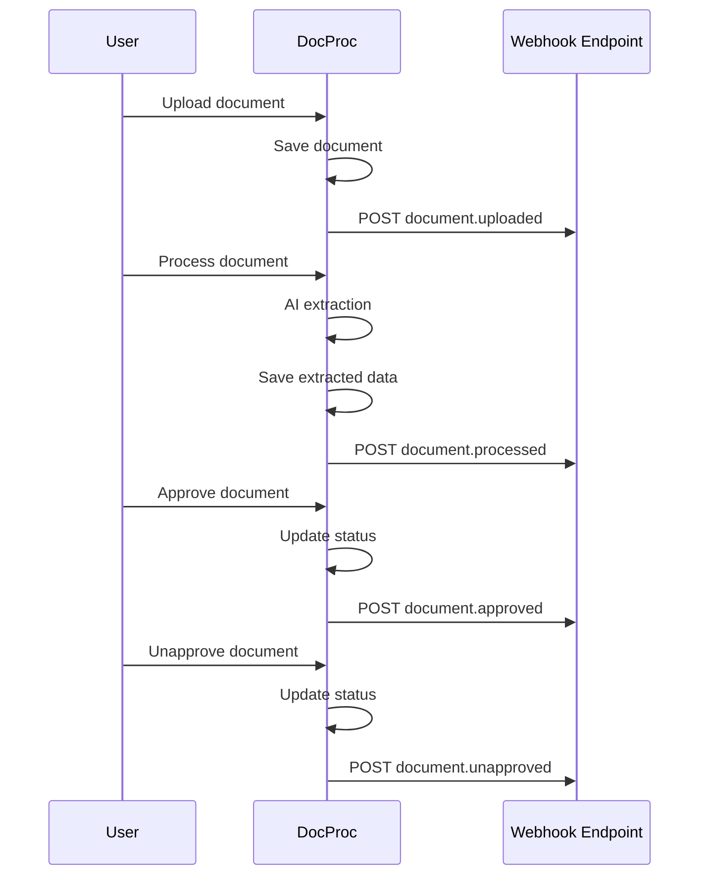

# Webhooks (Target)

## Overview

Webhooks remain **unchanged** from the current implementation. The webhook system is backend-agnostic and works the same way with Hono.

## Events

| Event | Trigger | Description |
|-------|---------|-------------|
| `document.uploaded` | Document file uploaded | New document created |
| `document.processed` | AI extraction complete | Status -> processed |
| `document.approved` | User approves document | Status -> approved |
| `document.unapproved` | User unapproves document | Status: approved -> other |

## Event Flow



## Configuration

Webhooks are configured per Document Type.

### Configuration Structure

```typescript
interface WebhookConfig {
  events: {
    [eventName: string]: {
      enabled: boolean
      url: string
      method: 'GET' | 'POST' | 'PUT' | 'PATCH'
      headers: WebhookHeader[]
    }
  }
}

interface WebhookHeader {
  name: string
  value: string
  sensitive: boolean  // Encrypted in database
}
```

### Example Configuration

```json
{
  "events": {
    "document.uploaded": {
      "enabled": false,
      "url": "",
      "method": "POST",
      "headers": []
    },
    "document.processed": {
      "enabled": false,
      "url": "",
      "method": "POST",
      "headers": []
    },
    "document.approved": {
      "enabled": true,
      "url": "https://api.example.com/webhooks/docproc",
      "method": "POST",
      "headers": [
        {
          "name": "Authorization",
          "value": "Bearer sk-xxx",
          "sensitive": true
        }
      ]
    },
    "document.unapproved": {
      "enabled": false,
      "url": "",
      "method": "POST",
      "headers": []
    }
  }
}
```

## Payload Format

```typescript
interface WebhookPayload {
  event: string
  timestamp: string  // ISO 8601
  documentType: {
    id: string
    name: string
  }
  document: {
    id: string
    filename: string
    status: string
    extractedData: object | null
    createdAt: string
    updatedAt: string
  }
}
```

### Example Payload

```json
{
  "event": "document.approved",
  "timestamp": "2025-01-08T12:00:00.000Z",
  "documentType": {
    "id": "550e8400-e29b-41d4-a716-446655440000",
    "name": "Invoice"
  },
  "document": {
    "id": "660e8400-e29b-41d4-a716-446655440001",
    "filename": "invoice-2024-001.pdf",
    "status": "approved",
    "extractedData": {
      "invoiceNumber": "INV-2024-001",
      "date": "2024-01-15",
      "total": 275.00
    },
    "createdAt": "2025-01-08T11:00:00.000Z",
    "updatedAt": "2025-01-08T12:00:00.000Z"
  }
}
```

## Batch Webhooks

For batch processing, a batch-specific webhook can be configured:

```typescript
// POST /api/batches
{
  "documentIds": ["uuid1", "uuid2"],
  "webhookUrl": "https://example.com/batch-complete"
}
```

When the batch completes:

```json
{
  "event": "batch.completed",
  "timestamp": "2025-01-08T12:00:00.000Z",
  "batchId": "uuid",
  "status": "completed",
  "total": 10,
  "completed": 8,
  "failed": 2
}
```

## Implementation

### Trigger Function

```typescript
// src/server/lib/webhooks.ts
export async function triggerWebhook(
  documentTypeId: string,
  document: Document,
  event: DocumentWebhookEventName
): Promise<void> {
  const docType = await db.query.documentTypes.findFirst({
    where: eq(documentTypes.id, documentTypeId),
  })

  if (!docType?.webhookConfig?.events?.[event]?.enabled) {
    return
  }

  const eventConfig = docType.webhookConfig.events[event]

  const payload: WebhookPayload = {
    event,
    timestamp: new Date().toISOString(),
    documentType: {
      id: docType.id,
      name: docType.name,
    },
    document: {
      id: document.id,
      filename: document.filename,
      status: document.status,
      extractedData: document.extractedData,
      createdAt: document.createdAt.toISOString(),
      updatedAt: document.updatedAt.toISOString(),
    },
  }

  // Build headers with decryption
  const headers: Record<string, string> = {
    'Content-Type': 'application/json',
  }

  for (const header of eventConfig.headers) {
    headers[header.name] = header.sensitive
      ? decrypt(header.value)
      : header.value
  }

  try {
    await fetch(eventConfig.url, {
      method: eventConfig.method,
      headers,
      body: JSON.stringify(payload),
    })
  } catch (error) {
    console.error(`Webhook failed for ${event}:`, error)
    // Don't throw - webhook failures shouldn't block main operation
  }
}
```

### Trigger Locations

```typescript
// src/server/routes/documents.ts

// On upload
await triggerWebhook(documentTypeId, document, 'document.uploaded')

// On status change
if (newStatus === 'approved') {
  await triggerWebhook(doc.documentTypeId, doc, 'document.approved')
}

// src/server/processing/engine.ts

// On processing complete
await triggerWebhook(doc.documentTypeId, doc, 'document.processed')
```

## Security

### Header Encryption

Sensitive headers are encrypted at rest:

- **Algorithm**: AES-256-GCM
- **Key**: `WEBHOOK_ENCRYPTION_KEY` environment variable
- **Format**: 64 hex characters (32 bytes)

```env
WEBHOOK_ENCRYPTION_KEY=0123456789abcdef0123456789abcdef0123456789abcdef0123456789abcdef
```

### Encryption Utilities

```typescript
// src/server/lib/webhook-encryption.ts
import { createCipheriv, createDecipheriv, randomBytes } from 'crypto'

const ALGORITHM = 'aes-256-gcm'
const KEY = Buffer.from(process.env.WEBHOOK_ENCRYPTION_KEY!, 'hex')

export function encrypt(text: string): string {
  const iv = randomBytes(16)
  const cipher = createCipheriv(ALGORITHM, KEY, iv)

  let encrypted = cipher.update(text, 'utf8', 'hex')
  encrypted += cipher.final('hex')

  const authTag = cipher.getAuthTag()

  return `${iv.toString('hex')}:${authTag.toString('hex')}:${encrypted}`
}

export function decrypt(encryptedText: string): string {
  const [ivHex, authTagHex, encrypted] = encryptedText.split(':')

  const iv = Buffer.from(ivHex, 'hex')
  const authTag = Buffer.from(authTagHex, 'hex')

  const decipher = createDecipheriv(ALGORITHM, KEY, iv)
  decipher.setAuthTag(authTag)

  let decrypted = decipher.update(encrypted, 'hex', 'utf8')
  decrypted += decipher.final('utf8')

  return decrypted
}
```

## Webhook UI

The webhook configuration UI remains unchanged from current implementation.

### Features

- Toggle events on/off
- Configure URL and method
- Manage custom headers
- Mark headers as sensitive
- Sensitive headers display as `[encrypted]`

## Best Practices

1. **Use HTTPS**: Always use HTTPS URLs for webhook endpoints
2. **Authenticate**: Include authentication headers (Bearer token, API key)
3. **Validate**: Verify webhook payloads on the receiving end
4. **Timeout**: Handle webhook calls with reasonable timeouts
5. **Retry**: Implement retry logic for transient failures (planned feature)

## File Locations (Target)

| Component | Path |
|-----------|------|
| Webhook Triggering | `src/server/lib/webhooks.ts` |
| Encryption Utils | `src/server/lib/webhook-encryption.ts` |
| UI Component | `src/client/components/webhook-config.tsx` |
