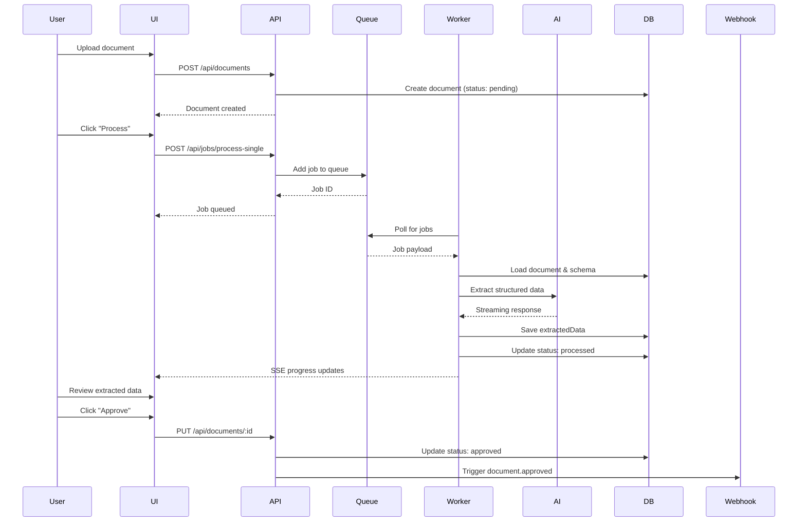
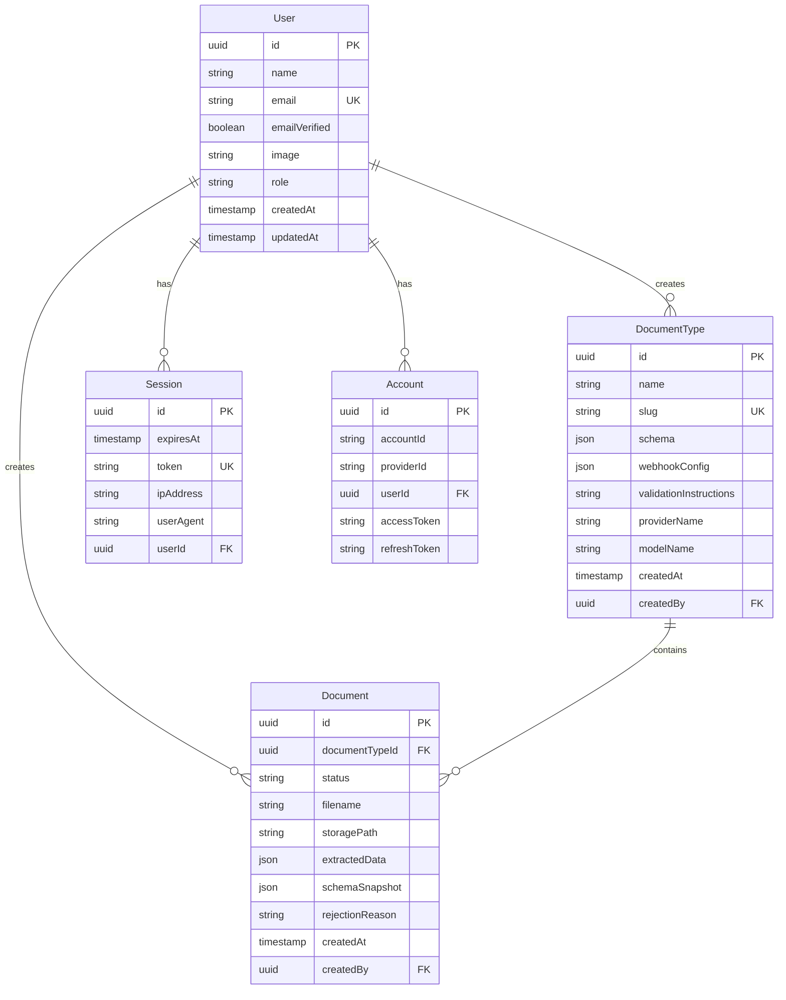

# Overview

## What is DocProc?

DocProc is a **human-in-the-loop document extraction platform** that uses AI vision models to extract structured data from documents. It combines automated AI processing with manual verification workflows to ensure data accuracy.

## Core Concepts

### Document Types

A **Document Type** defines the schema for extracting data from a category of documents. Examples:
- Invoices
- Receipts
- Medical records
- Tax forms

Each Document Type includes:
- **JSON Schema**: Defines the structure of extracted data
- **Validation Instructions**: Rules for AI to validate document type
- **AI Configuration**: Provider and model settings
- **Webhooks**: Event handlers for automation

### Documents

A **Document** is an uploaded file (PDF or image) associated with a Document Type. Documents flow through a status workflow:

```
pending → processed → approved
                   ↘ rejected
```

### Extraction Flow



## System Architecture

```
┌─────────────────────────────────────────────────────────────────────┐
│                           Client Layer                              │
│                                                                     │
│  ┌──────────────┐  ┌──────────────┐  ┌──────────────┐               │
│  │   Browser    │  │  API Client  │  │   Webhook    │               │
│  │     (UI)     │  │  (External)  │  │   Consumer   │               │
│  └──────┬───────┘  └──────┬───────┘  └──────────────┘               │
│         │                 │                                         │
└─────────┼─────────────────┼─────────────────────────────────────────┘
          │                 │
          ▼                 ▼
┌─────────────────────────────────────────────────────────────────────┐
│                         API Layer (Next.js)                         │
│                                                                     │
│  ┌──────────────┐  ┌──────────────┐  ┌──────────────┐               │
│  │  Auth API    │  │ Document API │  │   Jobs API   │               │
│  │ /api/auth/*  │  │/api/documents│  │  /api/jobs/* │               │
│  └──────────────┘  └──────────────┘  └──────────────┘               │
│                                                                     │
│  ┌──────────────┐  ┌──────────────┐  ┌──────────────┐               │
│  │  Server      │  │ Middleware   │  │    SSE       │               │
│  │  Actions     │  │ (Auth/CORS)  │  │  Streaming   │               │
│  └──────────────┘  └──────────────┘  └──────────────┘               │
└─────────────────────────────────────────────────────────────────────┘
          │                 │                 │
          ▼                 ▼                 ▼
┌─────────────────────────────────────────────────────────────────────┐
│                       Processing Layer                              │
│                                                                     │
│  ┌───────────────────────────────────────────────────────────┐      │
│  │                    BullMQ Job Queue                       │      │
│  │  ┌─────────────┐  ┌─────────────┐  ┌─────────────┐        │      │
│  │  │   Waiting   │  │   Active    │  │  Completed  │        │      │
│  │  │    Jobs     │  │    Jobs     │  │    Jobs     │        │      │
│  │  └─────────────┘  └─────────────┘  └─────────────┘        │      │
│  └───────────────────────────────────────────────────────────┘      │
│                              │                                      │
│  ┌───────────────────────────▼───────────────────────────────┐      │
│  │                   Worker Processes                         │      │
│  │  ┌─────────────────────┐  ┌─────────────────────┐          │      │
│  │  │  Document Processor │  │   Batch Processor   │          │      │
│  │  └─────────────────────┘  └─────────────────────┘          │      │
│  └───────────────────────────────────────────────────────────┘      │
└─────────────────────────────────────────────────────────────────────┘
          │                 │
          ▼                 ▼
┌─────────────────────────────────────────────────────────────────────┐
│                         Data Layer                                  │
│                                                                     │
│  ┌──────────────┐  ┌──────────────┐  ┌──────────────┐               │
│  │  PostgreSQL  │  │    Redis     │  │ File Storage │               │
│  │  (Drizzle)   │  │  (BullMQ)    │  │  (Local FS)  │               │
│  └──────────────┘  └──────────────┘  └──────────────┘               │
│                                                                     │
└─────────────────────────────────────────────────────────────────────┘
          │
          ▼
┌─────────────────────────────────────────────────────────────────────┐
│                       External Services                             │
│                                                                     │
│  ┌──────────────┐  ┌──────────────┐  ┌──────────────┐               │
│  │  Anthropic   │  │  OpenRouter  │  │   Webhook    │               │
│  │   Claude     │  │    (LLMs)    │  │  Endpoints   │               │
│  └──────────────┘  └──────────────┘  └──────────────┘               │
│                                                                     │
└─────────────────────────────────────────────────────────────────────┘
```

## Key Features

### 1. AI-Powered Extraction
- Vision model support (Claude, OpenRouter models)
- Structured output with JSON Schema validation
- Streaming responses for real-time progress
- Automatic JSON repair for malformed responses

### 2. Human-in-the-Loop
- Form-based data review and editing
- Approval workflow with status tracking
- Keyboard shortcuts for rapid processing
- Unsaved changes protection

### 3. Batch Processing
- Queue-based background processing
- Concurrent processing with rate limiting
- Cross-session job visibility
- SSE-based progress streaming

### 4. Flexible Schemas
- Visual schema builder
- Support for nested objects and arrays
- Table and pivoted table views for arrays
- Custom UI widgets

### 5. Integration Ready
- RESTful API with API key auth
- Webhook events for automation
- Bulk upload and processing endpoints

## Data Model



## File Locations

| Component | Location |
|-----------|----------|
| Database Schema | `src/db/schema/` |
| API Routes | `src/app/api/` |
| Server Actions | `src/lib/actions/` |
| Processing Logic | `src/lib/document-processing/` |
| Job Queue | `src/lib/jobs/` |
| UI Components | `src/components/` |
| Auth Config | `src/lib/auth.ts` |
| Providers | `src/lib/providers/` |
