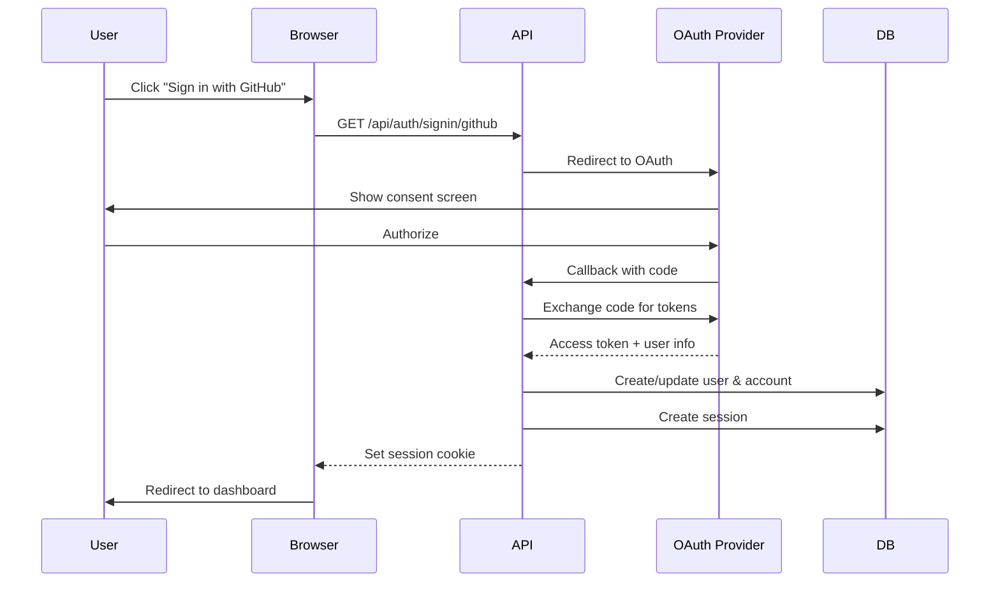

# Authentication & Authorization

## Overview

DocProc uses [Better-Auth](https://www.better-auth.com/) for authentication with support for social providers and optional email/password login. Authorization is role-based with three permission levels.

## Authentication Flow



## Social Providers

### GitHub

```env
AUTH_GITHUB_ENABLED=true
AUTH_GITHUB_CLIENT_ID=your-client-id
AUTH_GITHUB_CLIENT_SECRET=your-client-secret
```

**OAuth Callback URL**: `{BETTER_AUTH_URL}/api/auth/callback/github`

### Google

```env
AUTH_GOOGLE_ENABLED=true
AUTH_GOOGLE_CLIENT_ID=your-client-id
AUTH_GOOGLE_CLIENT_SECRET=your-client-secret
```

**OAuth Callback URL**: `{BETTER_AUTH_URL}/api/auth/callback/google`

### Microsoft

```env
AUTH_MICROSOFT_ENABLED=true
AUTH_MICROSOFT_CLIENT_ID=your-client-id
AUTH_MICROSOFT_CLIENT_SECRET=your-client-secret
AUTH_MICROSOFT_TENANT_ID=your-tenant-id
```

**OAuth Callback URL**: `{BETTER_AUTH_URL}/api/auth/callback/microsoft`

**Note**: Use `common` for tenant ID to support any Microsoft account, or a specific tenant ID for organization-only access.

## Email/Password Authentication

Optional email/password login for users without social accounts.

```env
AUTH_EMAIL_PASSWORD_ENABLED=true  # default: true
```

**Features**:
- Email verification: Disabled by default
- Sign-up: Disabled by default (invite-only mode)
- Password reset: Supported

## Session Management

| Setting | Value |
|---------|-------|
| Session duration | 7 days |
| Session update age | 24 hours |
| Storage | PostgreSQL via Drizzle |
| Cookie | HTTP-only, secure |

## Roles & Permissions

### Role Hierarchy

```
┌─────────────────────────────────────────────────────────────┐
│                          admin                               │
│  Full access to all features                                │
│  - Manage document types (CRUD)                             │
│  - Manage documents (CRUD)                                  │
│  - Override AI models                                       │
│  - View all users' documents                                │
└─────────────────────────────────────────────────────────────┘
                              │
                              ▼
┌─────────────────────────────────────────────────────────────┐
│                          user                                │
│  Standard access                                            │
│  - View document types (read-only)                          │
│  - Manage own documents (CRUD)                              │
│  - Cannot override AI models                                │
└─────────────────────────────────────────────────────────────┘
                              │
                              ▼
┌─────────────────────────────────────────────────────────────┐
│                          none                                │
│  No access (default for new users)                          │
│  - Cannot access any features                               │
└─────────────────────────────────────────────────────────────┘
```

### Permission Matrix

| Permission | admin | user | none |
|------------|-------|------|------|
| `documentType:create` | ✓ | | |
| `documentType:list` | ✓ | ✓ | |
| `documentType:update` | ✓ | | |
| `documentType:delete` | ✓ | | |
| `document:create` | ✓ | ✓ | |
| `document:list` | ✓ | ✓ | |
| `document:update` | ✓ | ✓ | |
| `document:delete` | ✓ | ✓ | |

### Admin Configuration

Automatically assign admin role to specific email addresses:

```env
AUTH_ADMIN_EMAILS=admin@example.com,superuser@company.com
```

Users with these emails receive `admin` role on account creation.

**Implementation**: `src/lib/auth.ts:57-65`

## API Authentication

### API Key

For external integrations and automation, use API key authentication:

```env
API_KEY=your-secure-api-key
```

**Usage**:
```http
GET /api/documents
x-api-key: your-secure-api-key
```

**Features**:
- Bypasses all permission checks
- Full access to all endpoints
- Ideal for automation pipelines

### Session Cookie

Browser-based authentication uses session cookies set by Better-Auth.

**Flow**:
1. User authenticates via OAuth or email/password
2. Server creates session in database
3. Session token set in HTTP-only cookie
4. Cookie sent automatically with requests

## Authorization Middleware

### API Routes

```typescript
// src/lib/api-auth.ts
const authCheck = await checkApiAuth({
  document: ['list', 'create'],
  documentType: ['list'],
})

if (!authCheck.success) {
  return new Response('Forbidden', { status: 403 })
}
```

### Server Actions

```typescript
// src/lib/actions/document.ts
const session = await auth.api.getSession({ headers: await headers() })
const hasPermission = await checkPermission(session.user.id, 'document:create')

if (!hasPermission) {
  throw new Error('Insufficient permissions')
}
```

## Database Schema

### User Table

```sql
CREATE TABLE "user" (
  "id" uuid PRIMARY KEY,
  "name" text,
  "email" text UNIQUE NOT NULL,
  "emailVerified" boolean DEFAULT false,
  "image" text,
  "role" text DEFAULT 'none',
  "createdAt" timestamp DEFAULT now(),
  "updatedAt" timestamp DEFAULT now()
);
```

### Session Table

```sql
CREATE TABLE "session" (
  "id" uuid PRIMARY KEY,
  "expiresAt" timestamp NOT NULL,
  "token" text UNIQUE NOT NULL,
  "createdAt" timestamp DEFAULT now(),
  "updatedAt" timestamp DEFAULT now(),
  "ipAddress" text,
  "userAgent" text,
  "userId" uuid REFERENCES "user"("id") ON DELETE CASCADE
);
```

### Account Table

```sql
CREATE TABLE "account" (
  "id" uuid PRIMARY KEY,
  "accountId" text NOT NULL,
  "providerId" text NOT NULL,
  "userId" uuid REFERENCES "user"("id") ON DELETE CASCADE,
  "accessToken" text,
  "refreshToken" text,
  "idToken" text,
  "accessTokenExpiresAt" timestamp,
  "refreshTokenExpiresAt" timestamp,
  "scope" text,
  "password" text,
  "createdAt" timestamp DEFAULT now(),
  "updatedAt" timestamp DEFAULT now()
);
```

## Security Considerations

### Sensitive Data

- Passwords are hashed before storage
- OAuth tokens are stored encrypted
- Session tokens are cryptographically random
- Webhook secrets are encrypted (AES-256-GCM)

### Rate Limiting

Optional AI processing rate limiting:

```env
AI_RATE_LIMIT_ENABLED=true
AI_RATE_LIMIT_REQUESTS=100
AI_RATE_LIMIT_WINDOW_MS=3600000  # 1 hour
```

### CORS

API routes are protected by Next.js default CORS policies. External API access should use API key authentication.
