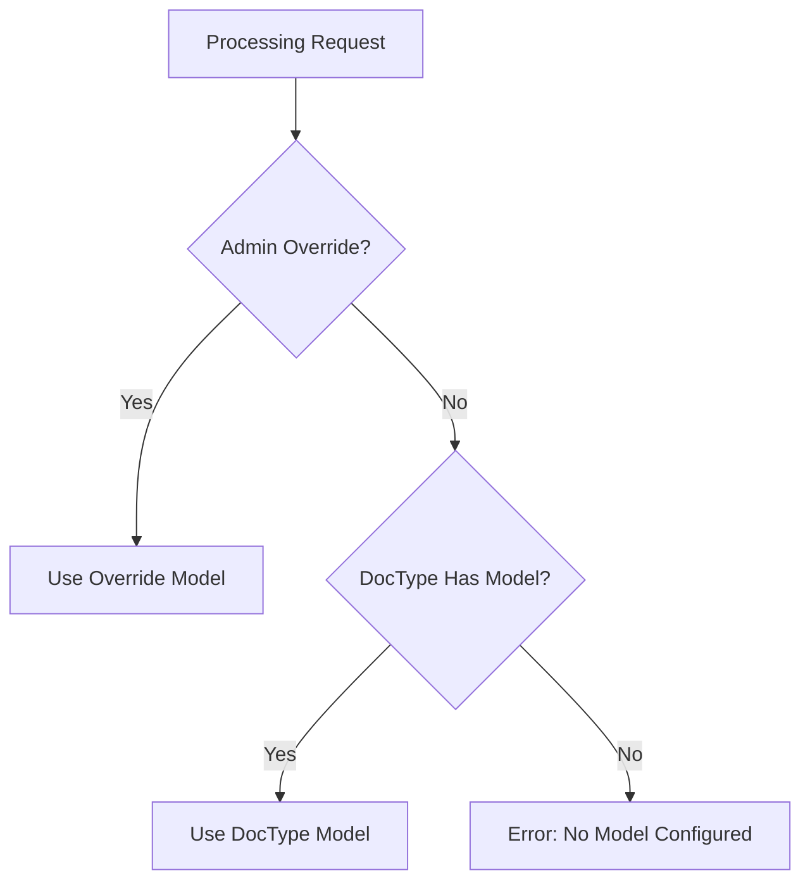
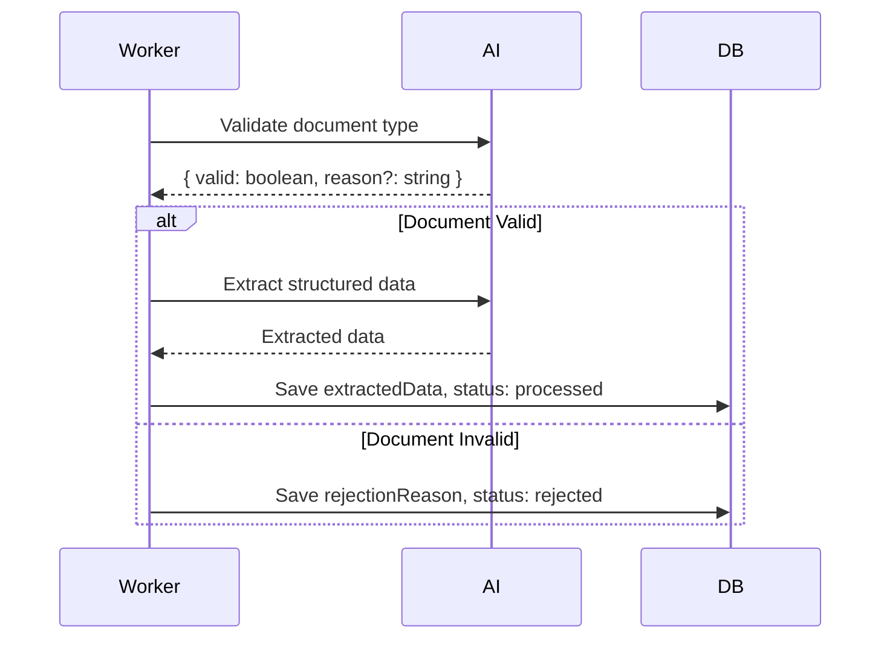

# Document Types

## Overview

A **Document Type** defines the extraction schema and configuration for a category of documents. It specifies what data to extract, how to validate documents, and how to handle events.

## Data Model

```typescript
interface DocumentType {
  id: string                        // UUID
  name: string                      // Display name
  slug: string                      // URL-friendly identifier
  schema: JsonSchema                // Extraction schema
  webhookConfig: WebhookConfig      // Event handlers (encrypted)
  validationInstructions: string    // AI validation rules
  providerName: string              // AI provider (anthropic, openrouter)
  modelName: string                 // AI model name
  createdAt: Date
  updatedAt: Date
  createdBy: string                 // User ID
  updatedBy: string                 // User ID
}
```

## JSON Schema

Document Types use JSON Schema to define the structure of extracted data.

### Supported Types

| Type | Description | Example |
|------|-------------|---------|
| `string` | Text values | Names, addresses, descriptions |
| `number` | Decimal numbers | Prices, percentages |
| `integer` | Whole numbers | Quantities, counts |
| `boolean` | True/false | Checkboxes, flags |
| `object` | Nested structure | Address with street, city, zip |
| `array` | List of items | Line items, attendees |

### Schema Example

```json
{
  "type": "object",
  "title": "Invoice",
  "properties": {
    "invoiceNumber": {
      "type": "string",
      "title": "Invoice Number"
    },
    "date": {
      "type": "string",
      "format": "date",
      "title": "Invoice Date"
    },
    "vendor": {
      "type": "object",
      "title": "Vendor",
      "properties": {
        "name": { "type": "string", "title": "Name" },
        "address": { "type": "string", "title": "Address" }
      }
    },
    "lineItems": {
      "type": "array",
      "title": "Line Items",
      "ui:widget": "table",
      "items": {
        "type": "object",
        "properties": {
          "description": { "type": "string", "title": "Description" },
          "quantity": { "type": "integer", "title": "Qty" },
          "unitPrice": { "type": "number", "title": "Unit Price" },
          "total": { "type": "number", "title": "Total" }
        }
      }
    },
    "subtotal": { "type": "number", "title": "Subtotal" },
    "tax": { "type": "number", "title": "Tax" },
    "total": { "type": "number", "title": "Total" }
  },
  "required": ["invoiceNumber", "date", "total"]
}
```

### UI Extensions

DocProc extends JSON Schema with custom UI hints:

| Extension | Type | Description |
|-----------|------|-------------|
| `ui:widget` | string | UI widget override |
| `ui:pivoted` | boolean | Pivot array table (columns ↔ rows) |
| `ui:displayTemplate` | string | Template for array item display |
| `title` | string | Field label |
| `description` | string | Help text |

#### Widget Options

| Widget | Field Type | Effect |
|--------|------------|--------|
| `textarea` | string | Multi-line text input |
| `table` | array | Display as editable table |

#### Display Templates

For array items, use `{{fieldName}}` placeholders:

```json
{
  "type": "array",
  "items": {
    "type": "object",
    "ui:displayTemplate": "{{description}} - ${{total}}",
    "properties": {
      "description": { "type": "string" },
      "total": { "type": "number" }
    }
  }
}
```

## AI Configuration

### Provider Selection

| Provider | Env Variable | Models |
|----------|--------------|--------|
| Anthropic | `ANTHROPIC_API_KEY` | claude-3-5-haiku, claude-3-5-sonnet, claude-3-7-sonnet |
| OpenRouter | `OPENROUTER_API_KEY` | Dynamic (fetched from API) |

### Model Selection Priority



## Validation Instructions

Optional AI-powered document validation before extraction.

### Purpose

- Verify document matches expected type
- Reject incorrect documents early
- Provide rejection reasons

### Format

Plain text instructions for the AI:

```
Validate that this document is an invoice. Check for:
- Invoice number or reference
- Date
- Vendor information
- Line items or charges
- Total amount

Reject if the document appears to be a quote, purchase order, or receipt.
```

### Validation Flow



## CRUD Operations

### Create Document Type

**Permission**: `documentType:create` (admin only)

```http
POST /api/document-types
Content-Type: application/json

{
  "name": "Invoice",
  "schema": { ... },
  "validationInstructions": "...",
  "providerName": "anthropic",
  "modelName": "claude-3-5-sonnet-20241022",
  "webhookConfig": { ... }
}
```

**Response**:
```json
{
  "id": "uuid",
  "name": "Invoice",
  "slug": "invoice",
  "schema": { ... },
  "createdAt": "2025-01-08T12:00:00.000Z"
}
```

### List Document Types

**Permission**: `documentType:list`

```http
GET /api/document-types
```

**Response**:
```json
[
  {
    "id": "uuid",
    "name": "Invoice",
    "document_count": 42,
    "createdAt": "2025-01-08T12:00:00.000Z"
  }
]
```

### Get Document Type

**Permission**: `documentType:list`

```http
GET /api/document-types/:id
```

### Update Document Type

**Permission**: `documentType:update` (admin only)

```http
PUT /api/document-types/:id
Content-Type: application/json

{
  "name": "Updated Name",
  "schema": { ... }
}
```

### Delete Document Type

**Permission**: `documentType:delete` (admin only)

```http
DELETE /api/document-types/:id
```

**Note**: Deleting a document type also deletes all associated documents and files.

## Webhook Configuration

See [Webhooks](./08-webhooks.md) for detailed webhook configuration.

### Quick Reference

```json
{
  "events": {
    "document.uploaded": {
      "enabled": true,
      "url": "https://example.com/webhook",
      "method": "POST",
      "headers": [
        { "name": "Authorization", "value": "Bearer xxx", "sensitive": true }
      ]
    },
    "document.approved": {
      "enabled": true,
      "url": "https://example.com/webhook",
      "method": "POST",
      "headers": []
    }
  }
}
```

## File Locations

| Component | Path |
|-----------|------|
| Schema Definition | `src/db/schema/app.ts:4-23` |
| Server Actions | `src/lib/actions/document-type.ts` |
| API Routes | `src/app/api/document-types/` |
| Schema Builder UI | `src/components/schema-builder/` |
