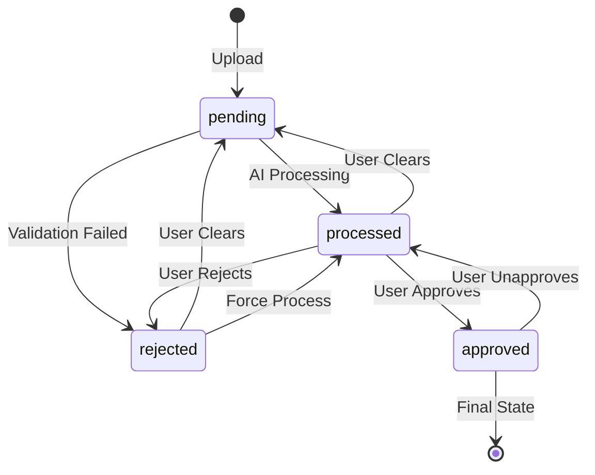
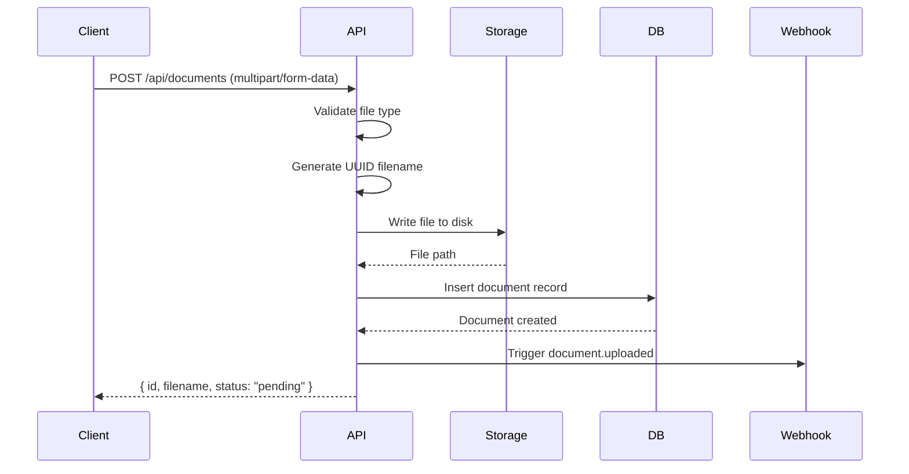
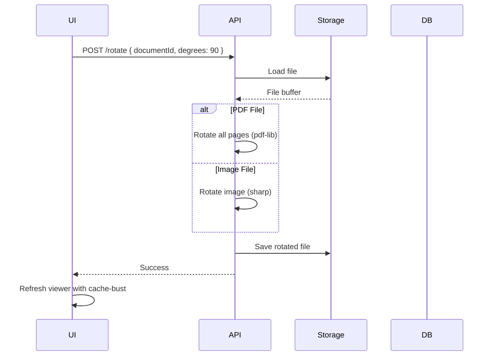

# Documents

## Overview

A **Document** represents an uploaded file (PDF or image) associated with a Document Type. Documents flow through a status workflow from upload to approval.

## Data Model

```typescript
interface Document {
  id: string                        // UUID
  documentTypeId: string            // FK to DocumentType
  status: DocumentStatus            // Workflow status
  filename: string                  // Original filename
  storagePath: string               // Relative path to file
  extractedData: object             // AI-extracted structured data
  schemaSnapshot: JsonSchema        // Schema at time of processing
  rejectionReason: string           // Reason for rejection
  createdAt: Date
  updatedAt: Date
  createdBy: string                 // User ID
  updatedBy: string                 // User ID
}

type DocumentStatus = 'pending' | 'processed' | 'approved' | 'rejected'
```

## Status Workflow



### Status Definitions

| Status | Description | Triggers |
|--------|-------------|----------|
| `pending` | Uploaded, awaiting processing | Upload, Clear action |
| `processed` | AI extraction complete, awaiting review | Processing complete |
| `approved` | Human verified and approved | User approval |
| `rejected` | Validation failed or user rejected | Validation fail, User rejection |

### Status Transitions

| From | To | Action | Webhook |
|------|-----|--------|---------|
| - | `pending` | Upload | `document.uploaded` |
| `pending` | `processed` | Processing | `document.processed` |
| `pending` | `rejected` | Validation fail | - |
| `processed` | `approved` | User approves | `document.approved` |
| `processed` | `rejected` | User rejects | - |
| `approved` | `processed` | User unapproves | `document.unapproved` |

## Upload Flow



### Supported File Types

| Type | Extensions | MIME Types |
|------|------------|------------|
| PDF | `.pdf` | `application/pdf` |
| Images | `.png`, `.jpg`, `.jpeg`, `.gif`, `.webp`, `.tiff`, `.bmp` | `image/*` |

### Upload with Auto-Processing

```http
POST /api/document-types/:id/upload?autoProcess=true
Content-Type: multipart/form-data

files: [file1.pdf, file2.pdf, ...]
```

**Response**:
```json
{
  "success": true,
  "documentTypeId": "uuid",
  "results": [
    { "filename": "invoice.pdf", "success": true, "documentId": "uuid" }
  ],
  "jobIds": ["process-doc-xxx"],
  "batchId": "uuid",
  "summary": { "total": 2, "uploaded": 2, "failed": 0 }
}
```

## CRUD Operations

### Create Document

**Permission**: `document:create`

```http
POST /api/documents
Content-Type: multipart/form-data

file: (binary)
documentTypeId: uuid
```

### List Documents

**Permission**: `document:list`

```http
GET /api/documents?documentTypeId=uuid&page=1&pageSize=50&status=pending&search=invoice
```

**Query Parameters**:

| Param | Type | Default | Description |
|-------|------|---------|-------------|
| `documentTypeId` | string | required | Filter by document type |
| `page` | number | 1 | Page number (1-based) |
| `pageSize` | number | 50 | Items per page (max: 100) |
| `status` | string | all | Filter by status |
| `search` | string | - | Search filename |

**Response**:
```json
{
  "documents": [...],
  "pagination": {
    "page": 1,
    "pageSize": 50,
    "total": 142,
    "totalPages": 3
  }
}
```

### Get Document

**Permission**: `document:list`

```http
GET /api/documents/:id
```

### Update Document

**Permission**: `document:update`

```http
PUT /api/documents/:id
Content-Type: application/json

{
  "extractedData": { ... },
  "status": "approved",
  "schemaSnapshot": { ... }
}
```

### Delete Document

**Permission**: `document:delete`

```http
DELETE /api/documents/:id
```

**Note**: Also deletes the file from storage.

### Download File

**Permission**: `document:list`

```http
GET /api/documents/:id/file
```

**Response Headers**:
- `Content-Type`: Appropriate MIME type
- `Content-Disposition`: `inline; filename="original.pdf"`
- `ETag`: File hash for caching
- `Last-Modified`: File modification time

### Bulk Status Update

**Permission**: `document:update`

```typescript
// Server Action
await bulkUpdateDocumentStatus(
  ['doc-id-1', 'doc-id-2'],
  'approved'
)
```

## Document Rotation

Rotate PDF pages or images.



**Supported Rotations**: Any multiple of 90 degrees

**Implementation**:
- PDFs: Uses `pdf-lib` to rotate all pages
- Images: Uses `sharp` for lossless rotation

## File Storage

### Current Implementation

Files are stored on the local filesystem.

```
data/documents/
├── a1b2c3d4-e5f6-7890-abcd-ef1234567890.pdf
├── b2c3d4e5-f6a7-8901-bcde-f12345678901.png
└── ...
```

### Path Resolution

```typescript
// Storage path is relative to DOCUMENT_STORAGE_DIR
const absolutePath = path.join(
  process.env.DOCUMENT_STORAGE_DIR || './data/documents',
  document.storagePath
)
```

### Future: Object Storage

See [Storage](./09-storage.md) for planned object storage migration.

## Filtering & Search

### Status Filter

```http
GET /api/documents?status=pending
GET /api/documents?status=processed
GET /api/documents?status=approved
GET /api/documents?status=rejected
GET /api/documents?status=all
```

### Filename Search

```http
GET /api/documents?search=invoice
```

Uses SQL `ILIKE` for case-insensitive partial matching.

### Combined Filters

```http
GET /api/documents?documentTypeId=xxx&status=pending&search=2024&page=1&pageSize=25
```

## UI Features

### Document Queue

- Checkbox multi-select
- Bulk actions (process, delete, status change)
- Status filter dropdown
- Search input
- Pagination controls
- Processing status indicators (spinner, clock)

### Document Processor

- Three-panel layout (queue, form, viewer)
- Resizable panels
- Unsaved changes protection
- Keyboard shortcuts

See [UI Components](./10-ui-components.md) for details.

## File Locations

| Component | Path |
|-----------|------|
| Schema | `src/db/schema/app.ts:25-48` |
| Server Actions | `src/lib/actions/document.ts` |
| API Routes | `src/app/api/documents/` |
| Storage Utils | `src/lib/storage.ts` |
| Queue Component | `src/components/document-queue.tsx` |
