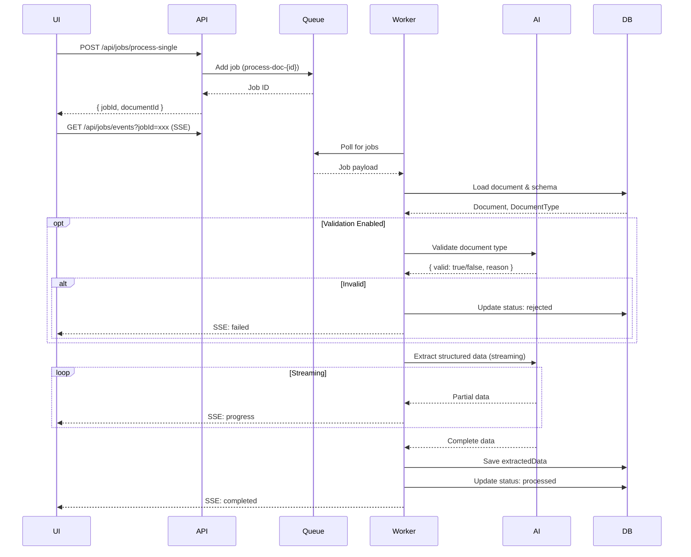
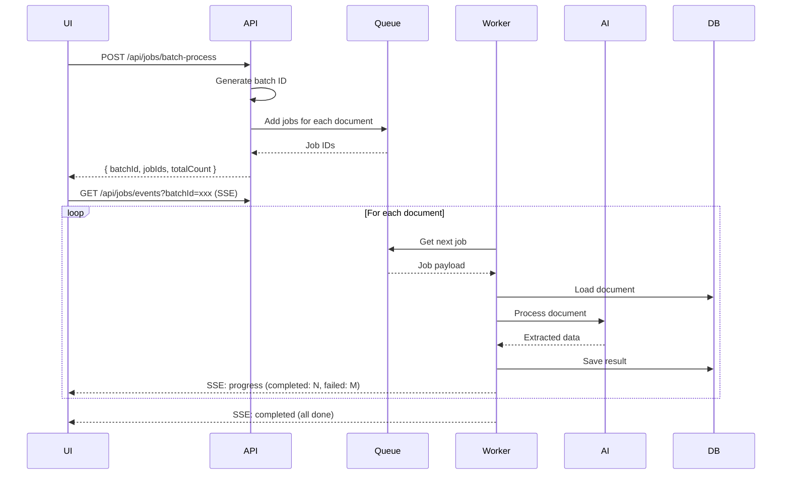
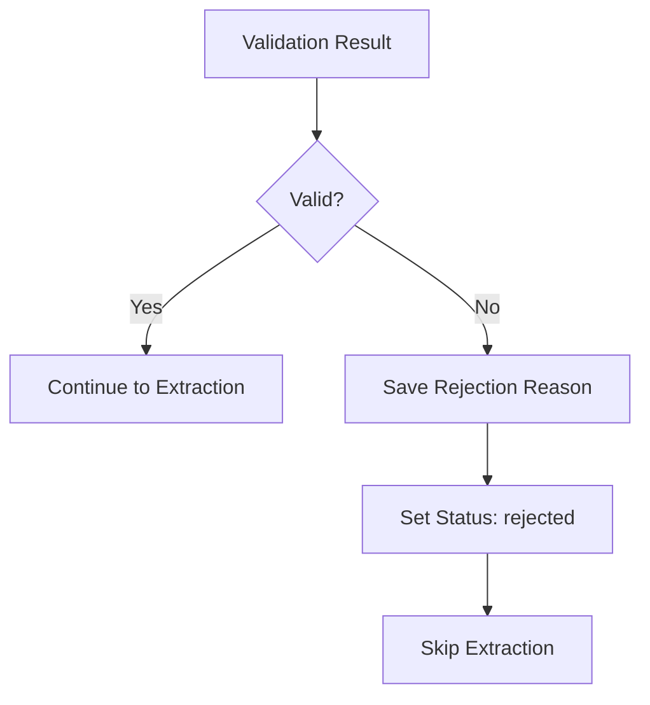

# Document Processing

## Overview

DocProc uses AI vision models to extract structured data from documents. Processing can be triggered for single documents or in batches, with real-time progress streaming via Server-Sent Events (SSE).

## Processing Architecture

```mermaid
flowchart TB
    subgraph Client
        UI[Browser UI]
        API_CLIENT[API Client]
    end

    subgraph API Layer
        SINGLE[/api/jobs/process-single]
        BATCH[/api/jobs/batch-process]
        SSE[/api/jobs/events SSE]
    end

    subgraph Queue Layer
        REDIS[(Redis)]
        BULLMQ[BullMQ Queue]
    end

    subgraph Worker Layer
        WORKER[Document Worker]
        PROCESSOR[AI Processor]
    end

    subgraph External
        ANTHROPIC[Anthropic API]
        OPENROUTER[OpenRouter API]
    end

    subgraph Data Layer
        DB[(PostgreSQL)]
        STORAGE[(File Storage)]
    end

    UI --> SINGLE
    UI --> BATCH
    UI <-.-> SSE
    API_CLIENT --> SINGLE
    API_CLIENT --> BATCH

    SINGLE --> BULLMQ
    BATCH --> BULLMQ
    BULLMQ <--> REDIS

    BULLMQ --> WORKER
    WORKER --> PROCESSOR
    PROCESSOR --> ANTHROPIC
    PROCESSOR --> OPENROUTER

    WORKER --> DB
    WORKER --> STORAGE
    WORKER -.-> SSE
```

## Processing Flow

### Single Document



### Batch Processing



## Job Queue

### Technology

- **Queue**: BullMQ v5.61.0
- **Backend**: Redis (via `VALKEY_URL` or `REDIS_URL`)
- **Job Persistence**: 24h completed, 7d failed

### Job Structure

```typescript
interface ProcessingJob {
  documentId: string
  documentTypeId: string
  schema: JsonSchema
  userId: string
  userName: string
  overrideModel?: string
  skipValidation?: boolean
  batchId?: string
  enableStreaming?: boolean
}
```

### Job ID Format

- Single: `process-doc-{documentId}`
- Batch: Jobs share `batchId` in data

### Concurrency

Default: 5 concurrent jobs per worker

## AI Extraction

### System Prompt

```typescript
const systemPrompt = `You are a document extraction assistant.
Today's date is ${new Date().toLocaleDateString()}.

Extract structured data from the document according to the provided schema.
Be precise and extract only what is visible in the document.
For dates, use ISO 8601 format (YYYY-MM-DD).
For numbers, use plain numeric values without currency symbols.`
```

### Request Structure

```typescript
{
  model: "claude-3-5-sonnet-20241022",
  messages: [
    { role: "system", content: systemPrompt },
    {
      role: "user",
      content: [
        { type: "file", data: fileBuffer, mimeType: "application/pdf" },
        { type: "text", text: "Extract data according to this schema: ..." }
      ]
    }
  ],
  output: {
    schema: jsonSchema
  }
}
```

### Streaming Response

AI responses are streamed for real-time progress:

```typescript
for await (const chunk of streamObject(request)) {
  // Broadcast partial data via SSE
  await job.updateProgress({
    partialData: chunk.object,
    stage: 'extracting'
  })
}
```

### JSON Repair

Malformed JSON responses are automatically repaired:

```typescript
import { jsonrepair } from 'jsonrepair'

const repaired = jsonrepair(malformedJson)
const data = JSON.parse(repaired)
```

## Document Validation

Optional pre-extraction validation to ensure document matches expected type.

### Configuration

Set `validationInstructions` on DocumentType:

```
Validate that this document is an invoice. Check for:
- Invoice number
- Date
- Vendor information
- Line items
- Total amount

Reject if document is a quote, receipt, or other type.
```

### Validation Response

```typescript
interface ValidationResult {
  valid: boolean
  reason?: string  // Only if invalid
}
```

### Handling Invalid Documents



## Server-Sent Events (SSE)

### Endpoint

```http
GET /api/jobs/events?jobId=xxx
GET /api/jobs/events?batchId=yyy
```

### Event Types

```typescript
// Connection established
{ type: 'connected', jobId: string }

// Processing progress
{
  type: 'progress',
  documentId: string,
  progressData: {
    partialData: object,
    stage: 'validating' | 'extracting',
    progress: number  // 0-100
  }
}

// Job completed successfully
{
  type: 'completed',
  documentId: string,
  data: object
}

// Job failed
{
  type: 'failed',
  documentId: string,
  error: string
}

// Batch progress (batch mode only)
{
  type: 'batch-progress',
  batchId: string,
  completed: number,
  failed: number,
  total: number
}
```

### Keep-Alive

SSE connection sends ping every 30 seconds to prevent timeout.

## Job Status Queries

### Get Job Status

```http
GET /api/jobs/status?jobIds=job1,job2,job3
```

**Response**:
```json
[
  {
    "jobId": "process-doc-xxx",
    "documentId": "uuid",
    "status": "active",
    "progress": { "partialData": {...}, "stage": "extracting" },
    "progressPercent": 45
  }
]
```

### Status Values

| Status | Description |
|--------|-------------|
| `waiting` | In queue, not started |
| `active` | Currently processing |
| `completed` | Successfully finished |
| `failed` | Failed with error |
| `delayed` | Scheduled for later |
| `paused` | Queue paused |
| `not_found` | Job doesn't exist |

### Cross-Session Visibility

Jobs are visible across browser sessions. Poll `/api/jobs/by-documents` to see jobs started by other users:

```http
GET /api/jobs/by-documents?documentIds=id1,id2,id3
```

## Job Cancellation

### Cancel Single Job

```http
POST /api/jobs/cancel
Content-Type: application/json

{ "jobId": "process-doc-xxx" }
```

**Note**: Only queued (waiting) jobs can be cancelled. Active jobs will complete.

### Cancel Batch

```http
POST /api/jobs/cancel-batch
Content-Type: application/json

{ "batchId": "uuid" }
```

Cancels all waiting jobs in the batch. Active jobs continue.

## Model Override

Admin users can override the AI model per request:

```http
POST /api/jobs/process-single
Content-Type: application/json

{
  "documentId": "uuid",
  "documentTypeId": "uuid",
  "schema": {...},
  "model": "claude-opus-4-20250514"
}
```

**Permission**: Admin only. Non-admin requests silently ignore override.

## Force Processing

Skip validation for rejected documents:

```http
POST /api/jobs/process-single
Content-Type: application/json

{
  "documentId": "uuid",
  "documentTypeId": "uuid",
  "schema": {...},
  "skipValidation": true
}
```

Useful for:
- Reprocessing incorrectly rejected documents
- Testing extraction on edge cases

## Rate Limiting

Optional rate limiting for AI API calls:

```env
AI_RATE_LIMIT_ENABLED=true
AI_RATE_LIMIT_REQUESTS=100
AI_RATE_LIMIT_WINDOW_MS=3600000
```

**Implementation**: `src/lib/ai-rate-limit.ts`

## Error Handling

### Transient Errors

- Network timeouts
- API rate limits
- Temporary service unavailability

**Handling**: BullMQ automatic retry (3 attempts with exponential backoff)

### Permanent Errors

- Invalid document format
- Schema validation failure
- Authentication failure

**Handling**: Job marked failed, error saved, no retry

## File Locations

| Component | Path |
|-----------|------|
| Job Submission | `src/lib/jobs/submission.ts` |
| Queue Config | `src/lib/jobs/queue.ts` |
| Single Worker | `src/lib/jobs/workers/single-document-processor.ts` |
| Batch Worker | `src/lib/jobs/workers/batch-processor.ts` |
| AI Processor | `src/lib/document-processing/processor.ts` |
| SSE Endpoint | `src/app/api/jobs/events/route.ts` |
| Process API | `src/app/api/jobs/process-single/route.ts` |
