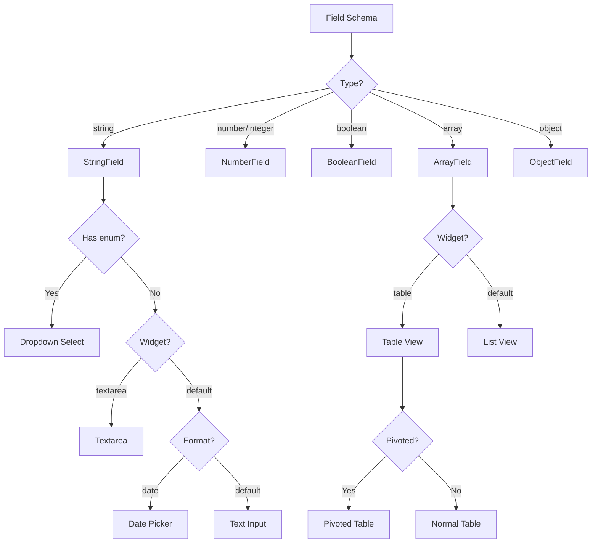
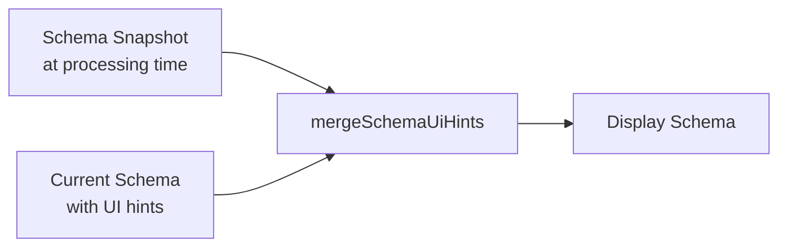

# Forms & Schema

## Overview

DocProc provides two main systems for working with JSON schemas:
1. **Schema Builder**: Visual editor for creating extraction schemas
2. **Form Renderer**: Dynamic form generation for data review and editing

## Schema Builder

### Purpose

Create and edit JSON schemas visually without writing JSON manually.

### Components

```
src/components/schema-builder/
├── index.tsx              # Main SchemaBuilder component
├── string-field-builder.tsx
├── number-field-builder.tsx
├── array-field-builder.tsx
├── object-field-builder.tsx
├── enum-builder.tsx
└── types.ts
```

### Field Type Builders

#### String Field

| Option | Description |
|--------|-------------|
| Title | Display label |
| Description | Help text |
| Pattern | Regex validation |
| Format | date, email, uri, etc. |
| Enum | Dropdown options |
| Widget | default, textarea |

#### Number/Integer Field

| Option | Description |
|--------|-------------|
| Title | Display label |
| Description | Help text |
| Minimum | Min value constraint |
| Maximum | Max value constraint |
| Default | Default value |

#### Boolean Field

| Option | Description |
|--------|-------------|
| Title | Display label |
| Description | Help text |
| Default | Initial value |

#### Array Field

| Option | Description |
|--------|-------------|
| Title | Display label |
| Description | Help text |
| Widget | default, table |
| Pivoted | Transpose table view |
| Display Template | Item display format |
| Items Schema | Nested schema for items |

#### Object Field

| Option | Description |
|--------|-------------|
| Title | Display label |
| Description | Help text |
| Properties | Nested fields |
| Required | Required field names |

### Usage

```tsx
import { SchemaBuilder } from '@/components/schema-builder'

<SchemaBuilder
  schema={schema}
  onChange={(newSchema) => setSchema(newSchema)}
/>
```

## Form Renderer

### Purpose

Render editable forms from JSON schemas for data review and editing.

### Components

```
src/components/form-renderer/
├── index.tsx              # Main FormRenderer + FormField
├── string-field.tsx       # Text, textarea, date, dropdown
├── number-field.tsx       # Number inputs
├── boolean-field.tsx      # Checkbox
├── array-field.tsx        # Lists and tables
├── object-field.tsx       # Nested objects
└── types.ts
```

### Field Type Rendering



### String Field Variants

#### Text Input (Default)

```json
{
  "type": "string",
  "title": "Invoice Number"
}
```

#### Textarea

```json
{
  "type": "string",
  "title": "Description",
  "ui:widget": "textarea"
}
```

#### Date Picker

```json
{
  "type": "string",
  "title": "Invoice Date",
  "format": "date"
}
```

#### Dropdown (Enum)

```json
{
  "type": "string",
  "title": "Status",
  "enum": ["pending", "paid", "overdue"]
}
```

### Array Field Variants

#### List View (Default)

Collapsible items with expand/collapse all:

```json
{
  "type": "array",
  "title": "Notes",
  "items": { "type": "string" }
}
```

#### Table View

Spreadsheet-like editing:

```json
{
  "type": "array",
  "title": "Line Items",
  "ui:widget": "table",
  "items": {
    "type": "object",
    "properties": {
      "description": { "type": "string" },
      "quantity": { "type": "integer" },
      "price": { "type": "number" }
    }
  }
}
```

#### Pivoted Table

Fields as rows, records as columns:

```json
{
  "type": "array",
  "title": "Comparison",
  "ui:widget": "table",
  "ui:pivoted": true,
  "items": {
    "type": "object",
    "properties": {
      "metric": { "type": "string" },
      "value": { "type": "number" }
    }
  }
}
```

### Table Navigation

Keyboard navigation in table view:

| Key | Action |
|-----|--------|
| `Enter` | Move to cell below |
| `Shift+Enter` | Move to cell above |
| `Arrow Down` | Move to cell below |
| `Arrow Up` | Move to cell above |
| `Tab` | Move to next cell |

### Display Templates

Custom display for collapsed array items:

```json
{
  "type": "array",
  "items": {
    "type": "object",
    "ui:displayTemplate": "{{name}} - ${{amount}}",
    "properties": {
      "name": { "type": "string" },
      "amount": { "type": "number" }
    }
  }
}
```

Renders as: `Office Supplies - $150.00`

### Streaming Mode

During AI processing, forms display in read-only streaming mode:

```tsx
<FormRenderer
  schema={schema}
  data={partialData}
  onChange={handleChange}
  isStreaming={true}  // Disables editing
/>
```

### Usage Example

```tsx
import { FormRenderer } from '@/components/form-renderer'

function DocumentEditor({ document, schema }) {
  const [data, setData] = useState(document.extractedData)

  return (
    <FormRenderer
      schema={schema}
      data={data}
      onChange={setData}
      isStreaming={false}
    />
  )
}
```

## Schema Merging

When displaying processed documents, UI hints from the current schema are merged with the stored schema snapshot:



This ensures:
- Data structure matches original processing
- UI preferences reflect current settings
- `ui:widget`, `ui:pivoted`, `ui:displayTemplate` are inherited

**Implementation**: `src/components/document-processor.tsx:109-135`

## Validation

### Required Fields

```json
{
  "type": "object",
  "properties": {
    "invoiceNumber": { "type": "string" },
    "date": { "type": "string" }
  },
  "required": ["invoiceNumber", "date"]
}
```

Required fields display red asterisk (*) in UI.

### Pattern Validation

```json
{
  "type": "string",
  "pattern": "^INV-[0-9]{4}$"
}
```

**Note**: Pattern validation is for reference only; not enforced in UI.

### Numeric Constraints

```json
{
  "type": "number",
  "minimum": 0,
  "maximum": 100
}
```

**Note**: Constraints are for reference; enforced during AI extraction.

## JSON Schema Reference

### Supported Keywords

| Keyword | Types | Description |
|---------|-------|-------------|
| `type` | all | Field type |
| `title` | all | Display label |
| `description` | all | Help text |
| `default` | all | Default value |
| `enum` | string, number | Dropdown options |
| `format` | string | Special format (date, email) |
| `pattern` | string | Regex pattern |
| `minimum` | number | Min value |
| `maximum` | number | Max value |
| `properties` | object | Nested fields |
| `required` | object | Required field names |
| `items` | array | Item schema |

### Custom Extensions

| Extension | Types | Description |
|-----------|-------|-------------|
| `ui:widget` | string, array | Widget override |
| `ui:pivoted` | array | Pivot table view |
| `ui:displayTemplate` | object | Display template for items |

## File Locations

| Component | Path |
|-----------|------|
| Form Renderer | `src/components/form-renderer/` |
| Schema Builder | `src/components/schema-builder/` |
| Type Definitions | `src/components/form-renderer/types.ts` |
| Schema Types | `src/components/schema-builder/types.ts` |
