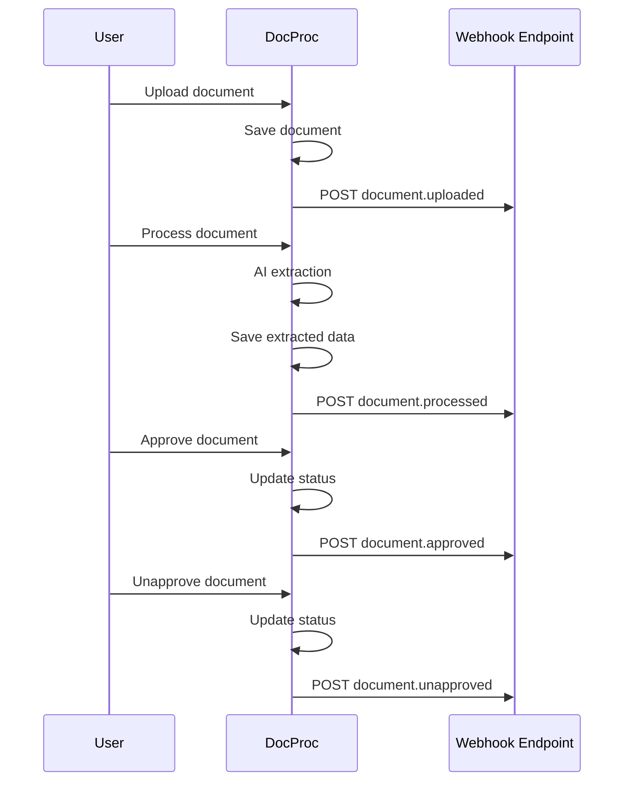

# Webhooks

## Overview

DocProc can send HTTP callbacks when document events occur. Webhooks enable integration with external systems, automation pipelines, and notification services.

## Events

| Event | Trigger | Description |
|-------|---------|-------------|
| `document.uploaded` | Document file uploaded | New document created |
| `document.processed` | AI extraction complete | Status → processed |
| `document.approved` | User approves document | Status → approved |
| `document.unapproved` | User unapproves document | Status: approved → other |

## Event Flow



## Configuration

Webhooks are configured per Document Type.

### Configuration Structure

```typescript
interface WebhookConfig {
  events: {
    [eventName: string]: {
      enabled: boolean
      url: string
      method: 'GET' | 'POST' | 'PUT' | 'PATCH'
      headers: WebhookHeader[]
    }
  }
}

interface WebhookHeader {
  name: string
  value: string
  sensitive: boolean  // Encrypted in database
}
```

### Example Configuration

```json
{
  "events": {
    "document.uploaded": {
      "enabled": false,
      "url": "",
      "method": "POST",
      "headers": []
    },
    "document.processed": {
      "enabled": false,
      "url": "",
      "method": "POST",
      "headers": []
    },
    "document.approved": {
      "enabled": true,
      "url": "https://api.example.com/webhooks/docproc",
      "method": "POST",
      "headers": [
        {
          "name": "Authorization",
          "value": "Bearer sk-xxx",
          "sensitive": true
        },
        {
          "name": "X-Custom-Header",
          "value": "custom-value",
          "sensitive": false
        }
      ]
    },
    "document.unapproved": {
      "enabled": false,
      "url": "",
      "method": "POST",
      "headers": []
    }
  }
}
```

## Payload Format

All webhook payloads follow this structure:

```typescript
interface WebhookPayload {
  event: string
  timestamp: string  // ISO 8601
  documentType: {
    id: string
    name: string
  }
  document: {
    id: string
    filename: string
    status: string
    extractedData: object | null
    createdAt: string
    updatedAt: string
  }
}
```

### Example Payload

```json
{
  "event": "document.approved",
  "timestamp": "2025-01-08T12:00:00.000Z",
  "documentType": {
    "id": "550e8400-e29b-41d4-a716-446655440000",
    "name": "Invoice"
  },
  "document": {
    "id": "660e8400-e29b-41d4-a716-446655440001",
    "filename": "invoice-2024-001.pdf",
    "status": "approved",
    "extractedData": {
      "invoiceNumber": "INV-2024-001",
      "date": "2024-01-15",
      "vendor": {
        "name": "Acme Corp",
        "address": "123 Main St"
      },
      "lineItems": [
        {
          "description": "Widget",
          "quantity": 10,
          "unitPrice": 25.00,
          "total": 250.00
        }
      ],
      "subtotal": 250.00,
      "tax": 25.00,
      "total": 275.00
    },
    "createdAt": "2025-01-08T11:00:00.000Z",
    "updatedAt": "2025-01-08T12:00:00.000Z"
  }
}
```

## Security

### Header Encryption

Sensitive headers (e.g., API keys, tokens) are encrypted at rest:

- **Algorithm**: AES-256-GCM
- **Key**: `WEBHOOK_ENCRYPTION_KEY` environment variable
- **Format**: 64 hex characters (32 bytes)

```env
WEBHOOK_ENCRYPTION_KEY=0123456789abcdef0123456789abcdef0123456789abcdef0123456789abcdef
```

### Header Handling in UI

- Sensitive headers display as `[encrypted]` placeholder
- Updating preserves encrypted values unless explicitly changed
- New sensitive values are encrypted before storage

### Best Practices

1. **Use HTTPS**: Always use HTTPS URLs for webhook endpoints
2. **Authenticate**: Include authentication headers (Bearer token, API key)
3. **Validate**: Verify webhook payloads on the receiving end
4. **Timeout**: Handle webhook calls with reasonable timeouts
5. **Retry**: Implement retry logic for transient failures

## Implementation

### Triggering Webhooks

```typescript
// src/lib/webhooks.ts
export async function triggerWebhook(
  docType: DocumentType,
  document: Document,
  event: DocumentWebhookEventName
): Promise<void>
```

### Trigger Locations

| Event | Location |
|-------|----------|
| `document.uploaded` | `src/lib/actions/document.ts` - createDocument |
| `document.processed` | `src/lib/actions/document.ts` - updateDocument |
| `document.approved` | `src/lib/actions/document.ts` - updateDocument |
| `document.unapproved` | `src/lib/actions/document.ts` - updateDocument |

### Error Handling

Webhook failures are logged but don't block the main operation:

```typescript
try {
  await triggerWebhook(docType, document, 'document.approved')
} catch (error) {
  console.error('Webhook failed:', error)
  // Continue with main operation
}
```

## Webhook UI

### Configuration Panel

Location: `src/components/webhook-config.tsx`

Features:
- Toggle events on/off
- Configure URL and method
- Manage custom headers
- Mark headers as sensitive
- Test webhook (future)

### Screenshot

```
┌─────────────────────────────────────────────────────────┐
│ Webhooks                                                │
├─────────────────────────────────────────────────────────┤
│                                                         │
│ ☐ document.uploaded                                     │
│                                                         │
│ ☐ document.processed                                    │
│                                                         │
│ ☑ document.approved                                     │
│   URL: https://api.example.com/webhooks/docproc         │
│   Method: POST                                          │
│   Headers:                                              │
│   ┌─────────────┬────────────────┬──────────┐           │
│   │ Name        │ Value          │ Sensitive│           │
│   ├─────────────┼────────────────┼──────────┤           │
│   │Authorization│ [encrypted]    │ ☑        │           │
│   │X-Custom     │ custom-value   │ ☐        │           │
│   └─────────────┴────────────────┴──────────┘           │
│   [+ Add Header]                                        │
│                                                         │
│ ☐ document.unapproved                                   │
│                                                         │
└─────────────────────────────────────────────────────────┘
```

## Testing Webhooks

### Manual Testing

Use tools like [webhook.site](https://webhook.site) or [RequestBin](https://requestbin.com) to test:

1. Get a temporary webhook URL
2. Configure in Document Type
3. Trigger the event (upload, approve, etc.)
4. Inspect the received payload

### Integration Testing

```typescript
// Example: Verify webhook payload
app.post('/webhook', (req, res) => {
  const { event, document, documentType } = req.body

  console.log(`Received ${event} for ${document.filename}`)

  // Process the webhook
  if (event === 'document.approved') {
    await syncToExternalSystem(document.extractedData)
  }

  res.status(200).send('OK')
})
```

## File Locations

| Component | Path |
|-----------|------|
| Webhook Triggering | `src/lib/webhooks.ts` |
| Encryption Utils | `src/lib/webhook-encryption.ts` |
| UI Component | `src/components/webhook-config.tsx` |
| Type Definitions | `src/lib/webhooks.ts` (types) |
