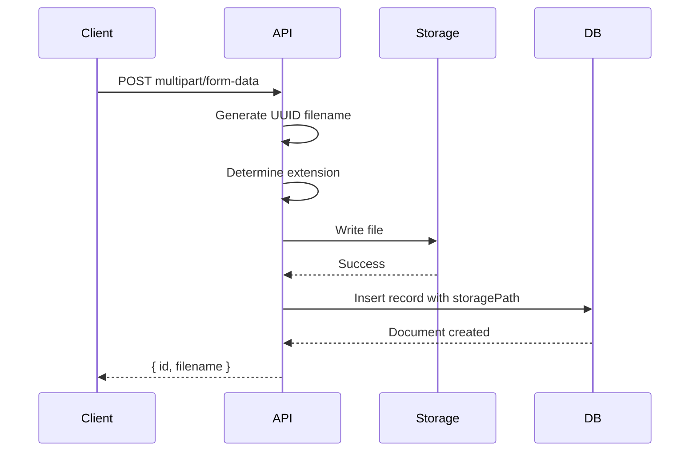
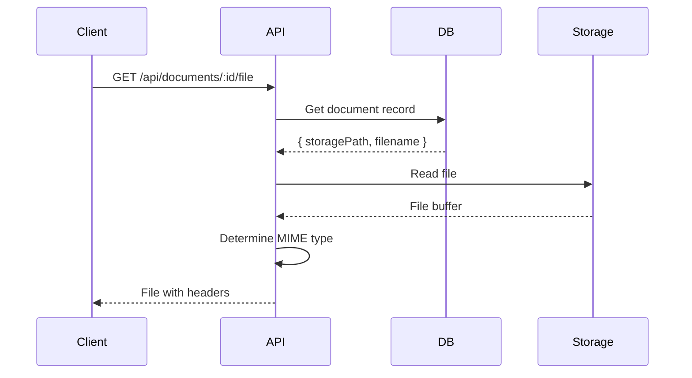
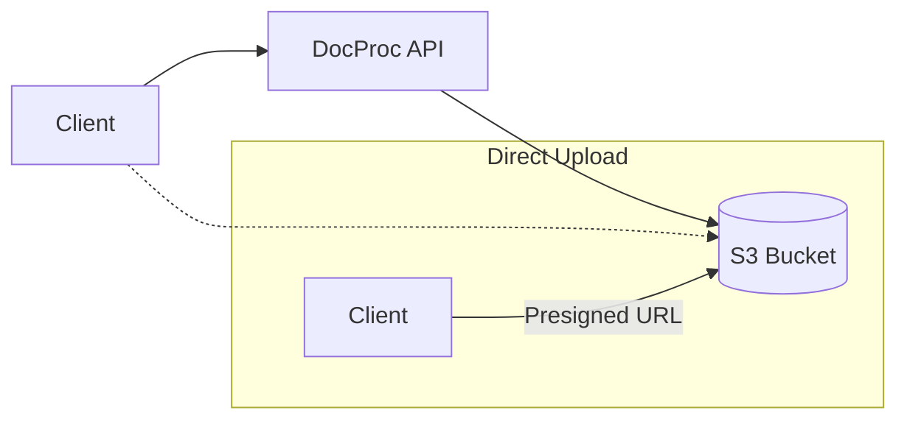
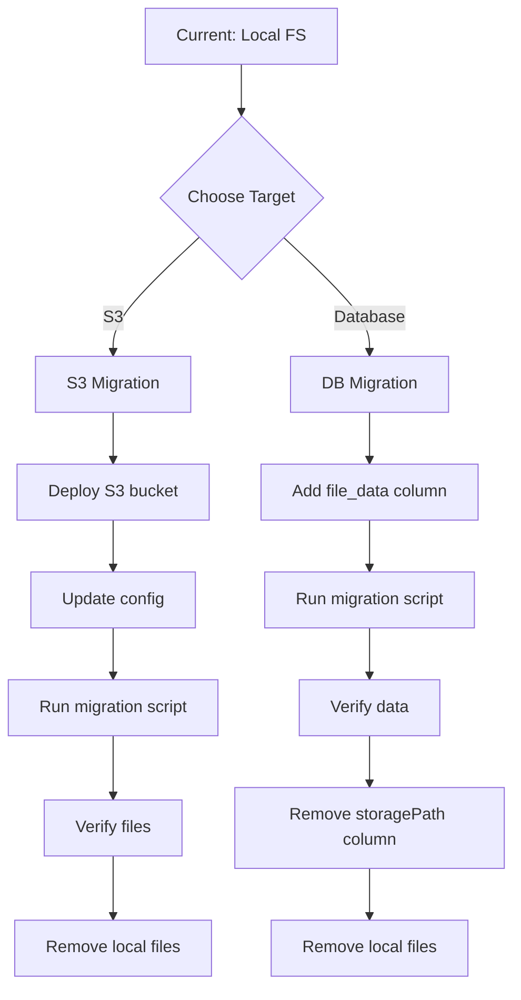

# Storage

## Overview

DocProc stores uploaded document files separately from database records. This document covers the current local filesystem implementation and future storage options.

## Current Implementation

### Local Filesystem

Files are stored on the local filesystem in a configurable directory.

```
data/documents/
├── a1b2c3d4-e5f6-7890-abcd-ef1234567890.pdf
├── b2c3d4e5-f6a7-8901-bcde-f12345678901.png
├── c3d4e5f6-a7b8-9012-cdef-123456789012.jpg
└── ...
```

### Configuration

```env
DOCUMENT_STORAGE_DIR=./data/documents
```

Default: `./data/documents` (relative to project root)

### File Naming

Files are renamed to UUIDs to:
- Prevent filename collisions
- Avoid special character issues
- Maintain privacy of original filenames

Original filename is preserved in database `filename` column.

### Path Resolution

```typescript
// src/lib/storage.ts

export function getDocumentPath(storagePath: string): string {
  const baseDir = process.env.DOCUMENT_STORAGE_DIR || './data/documents'

  // Handle both relative and absolute storage paths
  if (path.isAbsolute(storagePath)) {
    return storagePath
  }

  return path.join(baseDir, storagePath)
}
```

### Upload Flow



### Download Flow



## File Operations

### Create

```typescript
// On upload
const uuid = crypto.randomUUID()
const ext = path.extname(originalFilename)
const storagePath = `${uuid}${ext}`
const fullPath = path.join(storageDir, storagePath)

await fs.writeFile(fullPath, fileBuffer)
```

### Read

```typescript
// On download
const fullPath = getDocumentPath(document.storagePath)
const buffer = await fs.readFile(fullPath)
```

### Delete

```typescript
// On document deletion
const fullPath = getDocumentPath(document.storagePath)
await fs.unlink(fullPath)
```

### Rotate

```typescript
// PDF rotation
import { PDFDocument, degrees } from 'pdf-lib'

const pdfDoc = await PDFDocument.load(buffer)
for (const page of pdfDoc.getPages()) {
  page.setRotation(degrees(page.getRotation().angle + rotationDegrees))
}
const rotatedBuffer = await pdfDoc.save()
await fs.writeFile(fullPath, rotatedBuffer)

// Image rotation
import sharp from 'sharp'

const rotatedBuffer = await sharp(buffer)
  .rotate(rotationDegrees)
  .toBuffer()
await fs.writeFile(fullPath, rotatedBuffer)
```

## Caching

### ETag Support

File downloads include ETag for client-side caching:

```typescript
const stats = await fs.stat(fullPath)
const etag = `"${stats.size}-${stats.mtimeMs}"`

// Check If-None-Match
if (req.headers.get('if-none-match') === etag) {
  return new Response(null, { status: 304 })
}

return new Response(buffer, {
  headers: {
    'ETag': etag,
    'Last-Modified': stats.mtime.toUTCString(),
    'Cache-Control': 'private, max-age=3600'
  }
})
```

### Cache Busting

After rotation, client appends timestamp to URL:

```typescript
const fileUrl = `/api/documents/${docId}/file?t=${Date.now()}`
```

---

## Future: Object Storage

### Motivation

Local filesystem storage has limitations:
- Not suitable for horizontal scaling
- No built-in redundancy
- Limited by single server disk space
- Complex backup strategies

### Planned Options

#### Option 1: S3-Compatible Object Storage

Support for AWS S3, MinIO, Cloudflare R2, etc.

```env
STORAGE_TYPE=s3
S3_BUCKET=docproc-documents
S3_REGION=us-east-1
S3_ACCESS_KEY_ID=xxx
S3_SECRET_ACCESS_KEY=xxx
S3_ENDPOINT=https://s3.amazonaws.com  # or custom endpoint
```

**Benefits**:
- Scalable storage
- Built-in redundancy
- CDN integration
- Presigned URLs for direct upload/download

**Architecture**:


#### Option 2: Database Blob Storage

Store files directly in PostgreSQL.

```sql
ALTER TABLE documents ADD COLUMN file_data bytea;
```

**Benefits**:
- Single source of truth
- Transactional consistency
- Simplified backup (one system)
- No additional infrastructure

**Tradeoffs**:
- Increased database size
- Higher memory usage
- Slower for large files

**Best For**:
- Small deployments
- Documents under 10MB
- Simplified operations

### Proposed Storage Interface

```typescript
interface StorageProvider {
  // Upload file, return storage path/key
  upload(buffer: Buffer, filename: string): Promise<string>

  // Download file by path/key
  download(path: string): Promise<Buffer>

  // Delete file
  delete(path: string): Promise<void>

  // Get public/presigned URL (optional)
  getUrl?(path: string, expiresIn?: number): Promise<string>

  // Check if file exists
  exists(path: string): Promise<boolean>
}

// Implementations
class LocalStorageProvider implements StorageProvider { ... }
class S3StorageProvider implements StorageProvider { ... }
class DatabaseStorageProvider implements StorageProvider { ... }
```

### Migration Path



### Migration Script (Conceptual)

```typescript
async function migrateToS3() {
  const documents = await db.select().from(documentsTable)

  for (const doc of documents) {
    // Read from local
    const localPath = getDocumentPath(doc.storagePath)
    const buffer = await fs.readFile(localPath)

    // Upload to S3
    const s3Key = await s3.upload(buffer, doc.storagePath)

    // Update record
    await db.update(documentsTable)
      .set({ storagePath: s3Key })
      .where(eq(documentsTable.id, doc.id))

    // Optionally delete local
    await fs.unlink(localPath)
  }
}
```

## File Locations

| Component | Path |
|-----------|------|
| Storage Utils | `src/lib/storage.ts` |
| File API Route | `src/app/api/documents/[id]/file/route.ts` |
| Upload Handler | `src/app/api/document-types/[id]/upload/route.ts` |
| Rotation Logic | `src/lib/actions/document.ts` |
